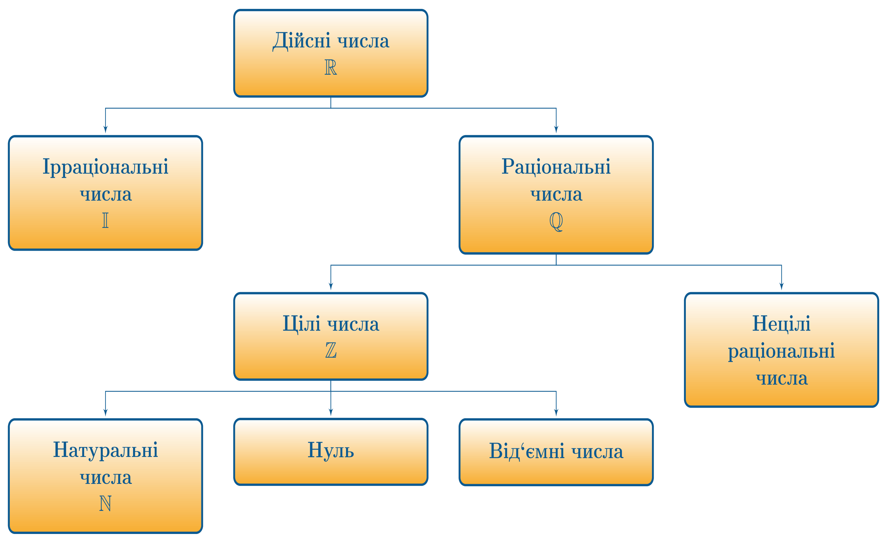
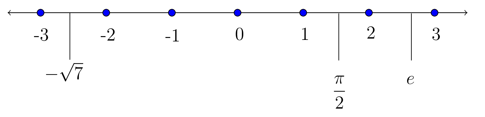

# Арифметика
# Числовi множини

Всі числа можна віднести до тієї чи іншої групи, об’єднуючи їх за певними ознаками та властивостями.

Найпростішою та найзрозумілішою множиною чисел є натуральні числа.

Означення

<b>Натуральнi числа</b> — це числа, якi виникають природним чином при лiчбi предметiв.

<i>Наприклад:</i> $$1,2,3,4 …$$

Числовi множини прийнято позначати латинськими великими лiтерами з подвiйним штрихом.

Множину натуральних чисел позначають знаком $$\mathbb{N}$$.

Множина цiлих чисел теж iнтуїтивно зрозумiла будь-якiй людинi.

Означення

<b>Цiлi числа</b> — множина, що складається з множини натуральних чисел, нуля, та множини вiд’ємних чисел (є протилежними до натуральних).

<i>Наприклад:</i> $$-1; 0;-20; 1254$$ тощо.

Множину натуральних чисел позначають знаком $$\mathbb{Z}$$.

Означення

<b>Рацiональнi числа</b> — множина нескоротних дробiв вигляду $$\dfrac{m}{n}$$ iз цiлим чисельником $$m$$ та натуральним знаменником $$n$$.

<i>Наприклад:</i> $$-1; \dfrac{20}{5};-\dfrac{1}{3}; 5; 10\dfrac{5}{7}$$ тощо.

Множину натуральних чисел позначають знаком $$\mathbb{Q}$$.

Означення

<b>Iррацiональнi числа</b> — числа, що не є рацiональними, тобто не можуть бути вираженi вiдношенням цiлих чисел. Мають вигляд нескiнченних десяткових дробiв.

<i>Наприклад:</i> $$e; \sin{21^\text{o}};\sqrt{17}$$ тощо.

Множину натуральних чисел позначають знаком $$\mathbb{I}$$.

Всi знають число $$\pi$$, яке i є iррацiональним $$3,14159265...$$ i так далi. Саме тому, що воно продовжується нескiнченно i нiяких закономiрностей у повтореннi нема, в свiтi часто влаштовуються змагання з запам’ятовування знакiв пiсля коми цього числа.

Означення

<b>Дiйснi числа</b> — множина, що складається з рацiональних та iррацiональних чисел. Кожному числу ставиться у вiдповiднiсть одна точка на числовiй прямiй,
та навпаки, кожна точка числової прямої являє собою дiйсне число.

Множину натуральних чисел позначають знаком $$\mathbb{R}$$.

Коли кажуть, що число належить до тiєї чи iншої множини, записують це за допомогою символа $$\in$$, що схожий на українську лiтеру Є.

<i>Наприклад:</i> $$6 \in \mathbb{N}, -1 \in \mathbb{Z}, 0,25 \in \mathbb{Q}, -\sqrt{26} \in \mathbb{R}.$$

<a href="#openModal">Open Modal</a>

	

		<a href="#close" title="Close" class="close">X</a>
		<h2>Modal Box</h2>
		
This is a sample modal box that can be created using the powers of CSS3.

	

