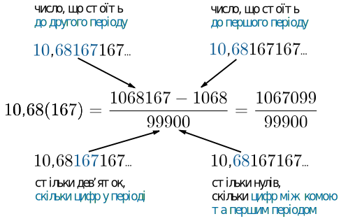

# Дроби та дiї над ними

Визначення

<b>Звичайний дрiб</b> — це число виду $$\dfrac{m}{n}$$ , де чисельник дробу $$m$$ та знаменник дробу $$n$$ – натуральнi числа. Якщо $$m < n$$ то дрiб <b>називають правильним</b>, якщо $$m\geq n$$ – <b>неправильним</b>.

Число, що є сумою натурального числа та звичайного дробу, називають **мiшаним**.

<b>Перевести мiшане число у звичайний дрiб</b> можна, помноживши цiлу частину на знаменник дробової частини та додавши до чисельника дробової частини.

<i>Наприклад:</i> $$10\dfrac{2}{7} = \dfrac{(10\cdot7+2)}{7}=\dfrac{72}{7}.$$

Неправильний дрiб можна перевести у мiшане число роздiливши чисельник на знаменник. Частка вiд дiлення буде цiлою частиною, остача – чисельником, дiльник – знаменником.

<b>Основна властивiсть дробу</b>: якщо i чисельник, i знаменник помножити чи подiлити на одне й те саме число, відмінне від нуля, отримаємо дрiб, що рiвний вихiдному.

<i>Наприклад:</i> $$\dfrac{5}{2} = \dfrac{(5\cdot7)}{2\cdot7} = \dfrac{35}{14}.$$

Тепер розглянемо <b>основнi дiї над дробами</b>. Розпочнемо з операцiї зведення до спiльного знаменника. Для чого вона потрiбна? По-перше, це дозволить легко порiвнювати дроби з рiзними знаменниками. По-друге, без цiєї операцiї неможливо зробити додавання та вiднiмання дробiв з рiзними знаменниками.

Алгоритм <b>Зведення дробiв до спiльного знаменника</b>

<ul>
<li>Знайти НСК знаменникiв дробiв.</li>
<li>Подiлити НСК на кожний зi знаменникiв i знайти додатковi множники.</li>
<li>Помножити чисельник i знаменник дробу на його додатковий множник.</li>
</ul>

<i>Наприклад:</i> звести дроби $$\dfrac{2}{9}$$ i $$\dfrac{7}{12}$$ до спiльного знаменника.  НСК $$(9,12) = 36.$$ Додатковi множники: $$\dfrac{36}{9} = 4$$, $$\dfrac{36}{12} = 3.$$ Маємо: $$\dfrac{(2\cdot4)}{(9\cdot4)} = \dfrac{8}{36}$$ i $$\dfrac{7\cdot3}{12\cdot3} = \dfrac{21}{36}.$$

**Дiї над дробами.**
* Додавання i вiднiмання. Сумою (рiзницею) двох дробiв з однаковими знаменниками $$\dfrac{a}{c}$$ i $$\dfrac{b}{c}$$ є дрiб з таким самим знаменником, а у чисельнику якого записана сума (рiзниця) чисельникiв: $$\dfrac{a\pm b}{c}$$. Якщо дроби мають різні знаменники, треба звести їх до спільного.

* Множення. Добутком двох дробів є дріб, у чисельнику якого стоїть добуток чисельників цих дробів, а у знаменнику – добуток знаменників: $$\dfrac{a}{c}\cdot \dfrac{b}{d}=\dfrac{a\cdot b}{c\cdot b}.$$

* Ділення. Операції ділення дробів еквівалентна операція множення на дріб, що є перевернутим: $$\dfrac{a}{c}:\dfrac{b}{d} = \dfrac{a}{c}\cdot \dfrac{d}{b}= \dfrac{a\cdot d}{c\cdot b}.$$

<iframe align="center" width="560" height="315" src="https://www.youtube.com/embed/1dnjaA-RC_A" frameborder="0" allowfullscreen></iframe>

Визначення

<b>Десятковий дрiб</b> — форма запису звичайного дробу зi знаменником вигляду $$10^n$$.

<i>Наприклад:</i> $$\dfrac{8}{10}=0,8$$; $$\dfrac{127}{10000}=0,0127.$$

Кожен звичайний дріб можна подати у вигляді <b>скінченого або нескінченого десяткового дробу</b>. Періодом нескінченого десяткового дробу називають найменшу групу цифр після коми, яка повторюється. Цей період записують один раз у круглих дужках.

<i>Наприклад:</i> $$2,1156156156... = 2,1(156)$$; $$0,133333333... = 0,1(3).$$

**Перетворення нескінченого періодичного дробу в звичайний.** Отриманий дріб матиме вигляд: у чисельнику стоїть різниця числа, яке стоїть до другого періоду, та числа, яке стоїть до першого періоду; у знаменнику записується цифра $$9$$ стільки разів, скільки цифр у періоді, і дописується цифра $$0$$ стільки разів, скільки цифр між комою і першим періодом.

<b>Стандартний вигляд числа</b> — це запис числа в експоненціальному вигляді $$a\cdot 10^n$$, де $$1\leq a < 10$$ – мантиса числа, а $$n \in \mathbb{Z}$$ – порядок. У стандартному вигляді легко представляти дуже маленькі або дуже великі числа.

<i>Наприклад:</i> $$256000 = 2,56\cdot 10^5; 0,00071 = 7,1\cdot 10^{-4}.$$

Коли записують число у такій формі, зручно користуватись так званим «пересуванням коми» для визначення показника $$n$$. Треба "пересунути" кому на певну кількість позицій таким чином, щоби отримати число від $$1$$ до $$10$$. Якщо кома зсувається ліворуч на $$n$$ позицій, то показник, відповідно, збільшується на $$n$$. Якщо праворуч – то зменшується на $$n$$.

Ось саме так записали $$256000$$. Для того, щоб отримати число від $$1$$ до $$10$$, треба пересунути кому на $$5$$ позицій ліворуч. Зсунувши кому на $$5$$ позицій ліворуч, ми збільшуємо показник на $$5$$. Отримуємо стандартний вигляд: $$2,56\cdot10^5$$. Аналогічно треба діяти з числом $$0,00074$$. Для того, щоб отримати число від $$1$$ до $$10$$, треба пересунути кому на $$4$$ позиції праворуч. Зсунувши кому на $$4$$ позиції праворуч, ми зменшуємо показник на $$4$$. В результаті, маємо $$7,4\cdot10^{-4}$$.

<quiz correctLabel="correct" incorrectLabel="incorrect" checkLabel="check">
    <question text="">
        
Чому дорівнює значення дробу $$\dfrac{\dfrac{5}{7}}{1\dfrac{4}{6}}$$?
 
        <answer correct> $$\dfrac{3}{7}$$</answer>
        <answer> $$\dfrac{70}{30}$$</answer>
        <answer> $$\dfrac{50}{30}$$</answer>
        <answer> $$1\dfrac{2}{3}$$</answer>
    <explanation>
    Спростимо дріб: $$\dfrac{\dfrac{5}{7}}{1\dfrac{4}{6}}=\dfrac{\dfrac{5}{7}}{\dfrac{10}{6}}=\dfrac{5}{7}\cdot\dfrac{6}{10}=\dfrac{3}{7}$$
    </explanation>
        </question>
    <question text="">
        
Обчисліть значення виразу $$5\dfrac{3}{5}\cdot7\dfrac{1}{2}:\dfrac{3}{20}-250$$

        <answer> $$10$$</answer>
        <answer> $$20$$</answer>
        <answer correct> $$30$$</answer>
        <answer> $$40$$</answer>
        <answer> $$50$$</answer>
    <explanation>
    Спростимо дріб: $$5\dfrac{3}{5}\cdot7\dfrac{1}{2}:\dfrac{3}{20}-250=\dfrac{28}{5}\cdot\dfrac{15}{2}\cdot\dfrac{20}{3}-250=28\cdot5\cdot2-250=30$$
    </explanation>
        </question>
</quiz>