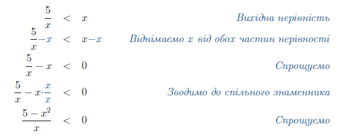
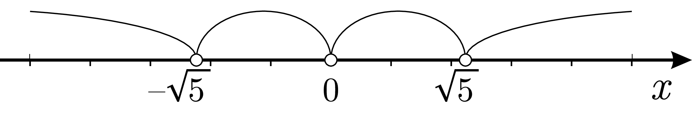
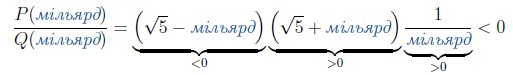
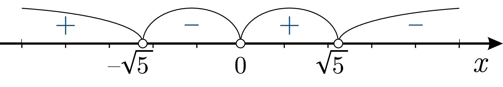
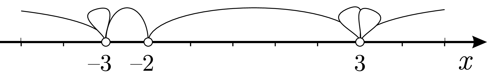
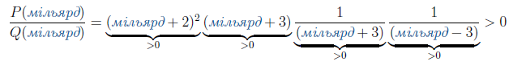
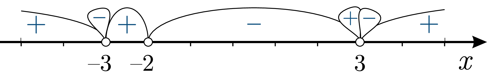
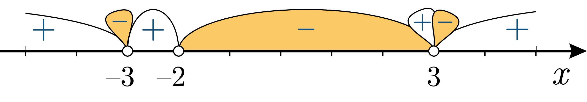

# Дробово-рацiональнi нерiвності

Означення

<b>Дробово-раціональна нерівність</b> —  це нерівність вигляду $$\dfrac{P(x)}{Q(x)}>0$$ або $$\dfrac{P(x)}{Q(x)}<0$$ або $$\dfrac{P(x)}{Q(x)}\geq0$$ або $$\dfrac{P(x)}{Q(x)}\leq0$$, де $$P(x)$$, $$Q(x)$$ – многочлени, а $$x$$ – змінна.

<i>Наприклад:</i> $$\dfrac{2}{x}<5;\quad\dfrac{6-x}{x^2-9}>0;\quad\dfrac{x^2-3x+5}{x(3x-1)(2x-6)(x-2)}<x.$$

Для розв’язання дробово-раціональних нерівностей користуються тим самим методом інтервалів.

Основна думка в цьому варіанті полягає у тому, що <b>дробово-раціональна функція може змінювати знак лише у точках, в яких вона рівна нулеві або не існує.
</b>

<b>Граничні точки</b> для дробово-раціональної функції можна знайти прирівнявши нулеві як чисельник: $$P(x)=0$$ (дробово-раціональна функція рівна нулю), так і знаменник: $$Q(x)=0$$ (дробово раціональна функція не існує).

Алгоритм <b>Метод інтервалів</b>

<ol>
<li>Виразити нерівність у вигляді $$\dfrac{P(x)}{Q(x)}>0$$ або $$\dfrac{P(x)}{Q(x)}<0$$, де $$P(x)$$, $$Q(x)$$ – многочлени.</li>
<li>Розв’язати рівняння $$P(x)=0$$ та $$Q(x)=0$$ знайшовши <b>граничні точки</b>.</li>
<li>Зобразити граничні точки на числовій прямій, розбивши її на інтервали.</li>
<li>Знайти знаки функції $$\dfrac{P(x)}{Q(x)}$$ на кожному інтервалі.</li>
<li>Обрати ті інтервали, на яких знаки $$\dfrac{P(x)}{Q(x)}$$ задовольняють вихідній нерівності.</li>
</ol>

Приклад

Розв’язати нерівність $$\dfrac{5}{x}<x$$. 

<b><i>Розв’язок</i></b>.

<ol>
<li>Перетворюємо нерівність до вигляду $$\dfrac{P(x)}{Q(x)}<0$$:</li>

<li>Многочлен в знаменнику $$5-x^2$$ можна розкласти на множники за допомогою формули різниці квадратів: $$5-x^2=(\sqrt{5}-x)(\sqrt{5}+x)$$.В результаті маємо:</li>

$$\dfrac{(\sqrt{5}-x)(\sqrt{5}+x)}{x}<0$$

<li>Граничні точки многочлена $$P(x)$$ в чисельнику: $$-\sqrt{5};\sqrt{5}$$, а граничні точки многочлена $$Q(x)$$ в знаменнику: $$0$$. Загальні граничні точки: $$-\sqrt{5};0;\sqrt{5}$$.</li>

Зобразимо їх на числовій прямій:

<li>Шукаємо знак функції на правому інтервалі $$(\sqrt{5};\infty)$$. Підставимо тестове значення «<i>мільярд</i>».</li>

Два множники додатні, один від’ємний – функція на цьому інтервалі має від’ємний знак.

Все, що потрібно зробити – проставити знаки на решті інтервалах справа наліво, почергово змінюючи знак на протилежний:

<li>Залишилось обрати інтервали, де функція додатна, бо за умовою $$\dfrac{P(x)}{Q(x)}<0$$. Такими є інтервали $$(-\sqrt{5};0)$$ та $$(0;\sqrt{5})$$.</li>

</ol>
<b>Вiдповiдь.</b> Отже, $$x \in (-\sqrt{5};0) \cup (0;\sqrt{5})$$.

Приклад

Розв’язати нерівність $$\dfrac{(x+2)^3(x+3)}{x^2-9}<0$$. 

<b><i>Розв’язок</i></b>.

Многочлен в знаменнику $$x^2-9$$ можна розкласти на множники за допомогою формули різниці квадратів: $$x^2-9=(x+3)(x-3)$$. В результаті маємо:

$$\dfrac{(x+2)^3(x+3)}{(x-3)(x+3)}<0$$

<ol start="3">
<li>Граничні точки многочлена $$P(x)$$ в чисельнику: $$-3;-2$$, а граничні точки многочлена $$Q(x)$$ в знаменнику: $$-3;3$$. Загальні граничні точки: $$-3;-2;3$$.</li>

Зобразимо їх на числовій прямій. Точка $$x=-3$$ має кратність «$$2$$» - малюємо одну «пелюстку» на числовій вісі. Точка $$x=-2$$ має кратність «$$3$$» - малюємо дві «пелюстки»:

<li>Шукаємо знак функції на правому інтервалі $$(3;\infty)$$. Підставимо тестове значення «<i>мільярд</i>».</li>

Всі чотири множники додатні, функція на цьому інтервалі має додатній знак.

Все, що потрібно зробити – проставити знаки на решті інтервалах справа наліво, почергово змінюючи знак на протилежний:

<li>Залишилось обрати інтервали, де функція додатна, бо за умовою $$\dfrac{P(x)}{Q(x)}<0$$. Таким є інтервал $$(-2;3)$$.</li>

</ol>
<b>Вiдповiдь.</b> Отже, $$x \in (-2;3)$$.

