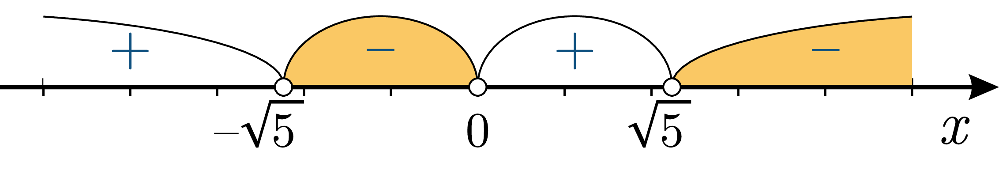

# Дробово-рацiональнi нерiвності

Визначення

<b>Дробово-раціональна нерівність</b> — це нерівність вигляду $$\dfrac{P(x)}{Q(x)}>0$$ або $$\dfrac{P(x)}{Q(x)}< 0$$ або $$\dfrac{P(x)}{Q(x)}\geq0$$ або $$\dfrac{P(x)}{Q(x)}\leq0$$, де $$P(x)$$, $$Q(x)$$ – многочлени, а $$x$$ – змінна.

<i>Наприклад:</i> $$\dfrac{2}{x}< 5;\quad\dfrac{6-x}{x^2-9}>0;\quad\dfrac{x^2-3x+5}{x(3x-1)(2x-6)(x-2)}< x.$$

Для розв’язання дробово-раціональних нерівностей користуються тим самим методом інтервалів.

Основна думка в цьому варіанті полягає в тому, що <b>дробово-раціональна функція може змінювати знак лише у точках, в яких вона рівна нулеві або не існує.
</b> 

<b>Граничні точки</b> для дробово-раціональної функції можна знайти прирівнявши нулеві як чисельник: $$P(x)=0$$ (дробово-раціональна функція рівна нулю), так і знаменник: $$Q(x)=0$$ (дробово-раціональна функція не існує).

Алгоритм <b>Метод інтервалів</b>

<ol>
<li>Виразити нерівність у вигляді $$\dfrac{P(x)}{Q(x)}>0$$ або $$\dfrac{P(x)}{Q(x)}<0$$, де $$P(x)$$, $$Q(x)$$ – многочлени.</li>
<li>Розв’язати рівняння $$P(x)=0$$ та $$Q(x)=0$$, знайшовши <b>граничні точки</b>.</li>
<li>Зобразити граничні точки на числовій прямій, розбивши її на інтервали.</li>
<li>Знайти знаки функції $$\dfrac{P(x)}{Q(x)}$$ на кожному інтервалі.</li>
<li>Обрати ті інтервали, на яких знаки $$\dfrac{P(x)}{Q(x)}$$ задовольняють вихідній нерівності.</li>
</ol>

Приклад

Розв’язати нерівність $$\dfrac{5}{x}< x$$.

<ul class="nav-tab" id="mytab">
    <button class="btn" data-target="#decision" data-toggle="pill">Розв’язок</button>
    <button class="btn" data-target="#answer" data-toggle="pill">Вiдповiдь</button>
    <button class="btn" data-target="#hide" data-toggle="pill">Приховати</button>
</ul>

    
 

<b><i>Розв’язок.</i> </b> 

<ol>
<li>Перетворюємо нерівність до вигляду $$\dfrac{P(x)}{Q(x)}< 0$$:</li>

<table style="border: none;" class="none">
<tr>
<td>$$
    \begin{align}
        \dfrac{5}{x} & \lt x \\
        \dfrac{5}{x} - x & \lt x - x \\
        \dfrac{5}{x} - x & \lt 0 \\
        \dfrac{5}{x} - x \cdot \dfrac{x}{x} & \lt 0 \\
        \dfrac{5 - x^2}{x} & \lt 0 
    \end{align}$$</td>
<td><i>Вихідна нерівність  Віднімаємо $$x$$ від обох частин нерівності  Спрощуємо  Зводимо до спільного знаменника  Спрощуємо</i>  </td>
</tr>
</table>

<li>Многочлен в знаменнику $$5-x^2$$ можна розкласти на множники за допомогою формули різниці квадратів: $$5-x^2=(\sqrt{5}-x)(\sqrt{5}+x)$$. У результаті маємо:</li>
 

$$\dfrac{(\sqrt{5}-x)(\sqrt{5}+x)}{x}< 0$$

<li>Граничні точки многочлена $$P(x)$$ в чисельнику: $$-\sqrt{5};\sqrt{5}$$, а граничні точки многочлена $$Q(x)$$ в знаменнику: $$0$$. Загальні граничні точки: $$-\sqrt{5};0;\sqrt{5}$$.</li>

Зобразимо їх на числовій прямій:

 
 

<li>Шукаємо знак функції на правому інтервалі $$(\sqrt{5};\infty)$$. Підставимо тестове значення «<i>мільярд</i>»:</li>
 

$$\dfrac{P({\text{мільярд}})}{Q({\text{мільярд}})} = \underbrace{\left( \sqrt{5} - \text{мільярд} \right)}_{\lt 0} \underbrace{\left( \sqrt{5} + \text{мільярд} \right)}_{\gt 0} \underbrace{\dfrac{1}{\text{мільярд}}}_{\gt 0} \lt 0$$

<!--

-->

Два множники додатні, один від’ємний – функція на цьому інтервалі має від’ємний знак.

Все, що потрібно зробити, – проставити знаки на решті інтервалів справа наліво, почергово змінюючи знак на протилежний:

<li>Залишилось обрати інтервали, де функція додатна, бо за умовою $$\dfrac{P(x)}{Q(x)}< 0$$. Такими є інтервали $$(-\sqrt{5};0)$$ та $$(0;\sqrt{5})$$.</li>

 

</ol>
    

    

<b>Вiдповiдь.</b> Отже, $$x \in (-\sqrt{5};0) \cup (0;\sqrt{5})$$.

    

    

Приклад

Розв’язати нерівність $$\dfrac{(x+2)^3(x+3)}{x^2-9}< 0$$.

<ul class="nav-tab" id="pr1">
<button class="btn" data-target="#decision1" data-toggle="tab">Розв’язок</button>
<button class="btn" data-target="#answer1" data-toggle="tab">Вiдповiдь</button>
<button class="btn" data-target="#hide1" data-toggle="tab">Приховати</button>
</ul>

  

<b><i>Розв’язок.</i> </b> 

Многочлен в знаменнику $$x^2-9$$ можна розкласти на множники за допомогою формули різниці квадратів: $$x^2-9=(x+3)(x-3)$$. В результаті маємо:

$$\dfrac{(x+2)^3(x+3)}{(x-3)(x+3)}< 0$$

<ol start="3">
<li>Граничні точки многочлена $$P(x)$$ в чисельнику: $$-3;-2$$, а граничні точки многочлена $$Q(x)$$ в знаменнику: $$-3;3$$. Загальні граничні точки: $$-3;-2;3$$.</li>

Зобразимо їх на числовій прямій. Точка $$x=-3$$ має кратність «$$2$$» — малюємо одну «пелюстку» на числовій осі. Точка $$x=-2$$ має кратність «$$3$$» — малюємо дві «пелюстки»:

 

<li>Шукаємо знак функції на правому інтервалі $$(3;\infty)$$. Підставимо тестове значення «<i>мільярд</i> ».</li>

<!--

-->

$$\dfrac{P({\text{мільярд}})}{Q({\text{мільярд}})} = \underbrace{\left( \text{мільярд} + 2 \right)^2}_{\gt 0} \underbrace{\left( \text{мільярд} + 3 \right)}_{\gt 0} \underbrace{\dfrac{1}{\text{мільярд} + 3}}_{\gt 0} \underbrace{\dfrac{1}{\text{мільярд} - 3}}_{\gt 0}  \gt 0$$

Всі чотири множники додатні, функція на цьому інтервалі має додатний знак.

Все, що потрібно зробити, – проставити знаки на решті інтервалів справа наліво, почергово змінюючи знак на протилежний:

 

<li>Залишилось обрати інтервали, де функція додатна, бо за умовою $$\dfrac{P(x)}{Q(x)}< 0$$. Таким є інтервал $$(-2;3)$$.</li>

</ol>
    

  

<b>Вiдповiдь.</b> Отже, $$x \in (-2;3)$$.

   

  

    

<quiz correctLabel="correct" incorrectLabel="incorrect" checkLabel="check">
 <question text="">
        
Скільки граничних точок має нерівність: $$\dfrac{(x-5)(x+1)(x-2)}{x^2-25}>0?$$

        <answer correct> $$4$$</answer>
        <answer> $$5$$</answer>
        <answer> $$6$$</answer>
        <answer> $$7$$</answer>
</question>
<question text="">
        
На скільки інтервалів розбивається числова пряма для нерівності: $$\dfrac{(x-5)(x+3)(x-3)}{x^2+9}<0?$$

        <answer> $$2$$</answer>
        <answer> $$3$$</answer>
        <answer correct> $$4$$</answer>
        <answer> $$5$$</answer>
</question>
</quiz>