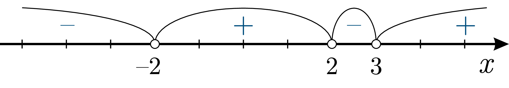
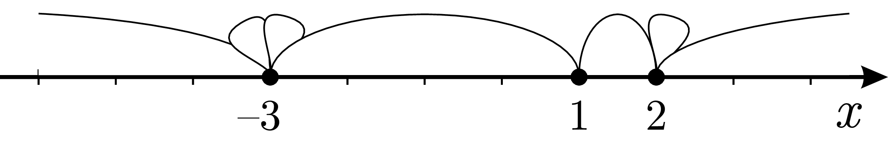

# Метод інтервалів

Будь-яку раціональну нерівність можна легко розв’язати за допомогою <b>методу інтервалів</b>. Зі схожою процедурою ми вже зустрічалися під час розв’язання рівнянь з модулями (див. розділ 8.2 <a href="http://math.ed-era.com/7/prost_rvnyannya_z_modulyami.html">Рівняння з модулями</a>). Саме таким методом ми скористалися для знаходження часу на відкриття парашута в попередній задачі.

<iframe align="center" width="560" height="315" src="https://www.youtube.com/embed/rDMuFT8bhWQ" frameborder="0" allowfullscreen></iframe>

Графіки допоможуть нам зрозуміти сутність методу інтервалів. Наприклад, поглянемо на графік функції
 
$$f(x)=x^3+2x^2-5x-6$$

Основна думка полягає в тому, що <b>раціональна функція може змінювати знак лише у точках, в яких вона рівна нулеві.</b>

Точки $$-3;-1;2$$ – це <b>граничні точки, між якими графік знаходиться або вище від осі $$x$$ (зображено синім), або нижче від осі $$x$$ (зображено оранжевим).

Знаходження граничних точок функції, що стоїть в нерівності, – це дуже важливий крок при розв’язанні раціональних нерівностей. Ці точки можна знайти, розв’язавши рівняння $$f(x)=0$$.

Єдине, що залишиться – обрати необхідні інтервали залежно від знака нерівності.

Алгоритм <b>Метод інтервалів</b>

<ol>
<li>Виразити нерівність у вигляді $$P(x)>0$$ або $$P(x)<0$$, де $$P(x)$$ – многочлен.</li>
<li>Розв’язати рівняння $$P(x)=0$$, знайшовши <b>граничні точки</b>.</li>
<li>Зобразити граничні точки на числовій прямій, розбивши її на інтервали.</li>
<li>Знайти знаки функції $$P(x)$$ на кожному інтервалі.</li>
<li>Обрати ті інтервали, на яких знаки $$P(x)$$ задовольняють вихідну нерівність.</li>
</ol>

Приклад

Розв’язати нерівність $$x^3+8x-16>4(3x-x^2)$$.

<ul class="nav-tab" id="mytab">
    <button class="btn" data-target="#decision" data-toggle="pill">Розв’язок</button>
    <button class="btn" data-target="#answer" data-toggle="pill">Вiдповiдь</button>
    <button class="btn" data-target="#hide" data-toggle="pill">Приховати</button>
</ul>

    

<b><i>Розв’язок</i></b>.

<ol>
<li>Виразимо нерівність у вигляді $$P(x)>0$$ або $$P(x)<0$$:</li>

Перетворюємо нерівність таким чином, аби праворуч залишився нуль:

<table style="border: none;" class="none">
<tr>
<td>$$
    \begin{align}
        x^3 + 8x - 16 & \gt 4(3x-x^2) \\
        x^3 + 8x - 16 & \gt \color{#1570bd}1\color{#1570bd}2\color{#1570bd}x\color{#1570bd}-\color{#1570bd}4\color{#1570bd}x^\color{#1570bd}2 \\
        x^3 + 8x - 16 \color{#1570bd}- \color{#1570bd}1\color{#1570bd}2\color{#1570bd}x \color{#1570bd}+ \color{#1570bd}4\color{#1570bd}x^\color{#1570bd}2 & \gt 12x - 4x^2 \color{#1570bd}-\color{#1570bd}1\color{#1570bd}2\color{#1570bd}x \color{#1570bd}+ \color{#1570bd}4\color{#1570bd}x^\color{#1570bd}2 \\
        x^3 + 4x^2 -4x -16 & \gt 0
    \end{align}$$</td>
<td><i>Вихідна нерівність Розкриваємо дужки Додаємо до обох частин $$4x^2 - 12x$$ Спрощуємо</i></td>
</tr>
</table>

<li>Розв’яжемо рівняння $$P(x)=0$$, розклавши многочлен у лівій частині на множники:</li>

<table style="border: none;" class="none">
<tr>
<td>$$
    \begin{align}
        x^3 + 4x^2 -4x -16 & = 0 \\
        x^2(x+4) - 4x - 16 & = 0 \\
        x^2(x+4) - 4(x+4) & = 0 \\
        (x+4)(x^2-4) & = 0 \\
        (x+4)(x+2)(x-2) & = 0
    \end{align}$$</td>
<td><i>Вихідна нерівність Виносимо за дужки $$x^2$$ Виносимо за дужки $$-4$$ Виносимо за дужки $$(x+4)$$ За формулою різниці квадратів розкладаємо $$x^2-4$$</i></td>
</tr>
</table>

Отже, граничні точки: $$-4;-2;2$$.

<li>Зобразимо ці точки на числовій прямій.</li>

В результаті утворилося чотири інтервали:

<li>Шукаємо знаки функції $$P(x)$$ на кожному інтервалі. Для цього беремо якесь тестове значення $$x$$ з кожного інтервалу, підставляємо його у функцію та дивимося на її знак:</li>
<table>
<tr>
<td>Інтервал</td>
<td>Тестове значення</td>
<td>Підстановка у функцію</td>
<td>Знак функції</td>
</tr>
<tr>
<td>$$(-\infty;-4)$$</td>
<td>$$-5$$</td>
<td>$$P(-5)=(-5)^3+4(-5)^2-4\cdot(-5)-16=-21$$</td>
<td>$$-$$</td>
</tr>
<tr>
<td>$$(-4;-2)$$</td>
<td>$$-3$$</td>
<td>$$P(-3)=(-3)^3+4(-3)^2-4\cdot(-3)-16=5$$</td>
<td>$$+$$</td>
</tr>
<tr>
<td>$$(-2;2)$$</td>
<td>$$0$$</td>
<td>$$P(0)=(0)^3+4(0)^2-4\cdot0-16=-16$$</td>
<td>$$-$$</td>
</tr>
<tr>
<td>$$(2;\infty)$$</td>
<td>$$3$$</td>
<td>$$P(3)=(3)^3+4(3)^2-4\cdot3-16=35$$</td>
<td>$$+$$</td>
</tr>
</table>
<li>Зобразимо ці знаки на числовій прямій та оберемо тільки необхідні інтервали. </li>

Нерівність післе зведення набула вигляду $$P(x)>0$$, де $$P(x)=x^3+4x^2-4x-16$$ 

Тому підходять лише ті інтервали, в яких функція $$P(x)$$ набуває додатних значень: $$(-4;-2)$$ та $$(2;\infty)$$. Таким чином $$x \in (-4;-2) \cup (2;\infty)$$.

<ol>
    

    

<b>Вiдповiдь.</b> $$x \in (-4;-2) \cup (2;\infty).$$
    

    

Метод «пелюстки»

Насправді розв’язувати нерівності можна набагато простіше, зокрема шукати знак функції на всіх інтервалах підстановкою не потрібно. Достатньо знайти його на крайньому правому інтервалі.  Цей інтервал завжди має вигляд: $$(a;\infty)$$ – він необмежений справа. Для визначення знака можна підставити будь-яке число з інтервалу.

Візьмемо щось велике, наприклад, <i>мільярд</i>. Підставляючи <i>мільярд</i> у функцію, одразу розуміємо, який знак приймає ця функція без обчислення фактичного значення.

Всі решта знаків вже автоматично відомі. При переході через граничну точку <b>знак інтервалу буде змінюватись на протилежний.</b>

У випадку, коли гранична точка є <b>кратним коренем</b>, або, іншими словами, в розкладі на множники двочлен з таким коренем стоїть у степені більшому за одиницю, тобто присутній множник вигляду $$(x-x_i )^k$$, – починаємо малювати «<b>пелюстки</b>».

Нехай корінь має кратність $$2$$ – можна вважати, що це два окремих корені, між якими є інтервал, що злилися в одну точку на числовій осі. Початок і кінець інтервалу збігається, і він згортається у «пелюстку». При кратності $$3$$, відповідно, маємо три однакові корені, між якими є два інтервали, що згортаються у дві «пелюстки», і т.д.

Приклад

Розв’язати нерівність $$(x-2)(x+2)(x-3)>0$$. 

<ul class="nav-tab" id="pr1">
<button class="btn" data-target="#decision1" data-toggle="tab">Розв’язок</button>
<button class="btn" data-target="#answer1" data-toggle="tab">Вiдповiдь</button>
<button class="btn" data-target="#hide1" data-toggle="tab">Приховати</button>
</ul>

  

<b><i>Розв’язок</i></b>.

Многочлен в лівій частині $$P(x)=(x-2)(x+2)(x-3)$$ вже розкладений на множники, переходимо до п.$$3$$ алгоритму методу інтервалів.

<ol start="3">
<li>Граничні точки многочлена: $$-2;2;3$$.</li>

Зобразимо їх на числовій прямій.

<li>Шукаємо знак функції на правому інтервалі $$(3;\infty)$$. Підставимо тестове значення «<i>мільярд</i>».</li>

$$P(\color{#0F5181}{\textit{мільярд}}) = (\underbrace{ \color{#0F5181}{\textit{мільярд}}-2}_{>\thinspace\mbox{0}}) \, (\underbrace{ \color{#0F5181}{\textit{мільярд}}+2}_{>\thinspace\mbox{0}}) \, (\underbrace{ \color{#0F5181}{\textit{мільярд}}-3}_{>\thinspace\mbox{0}}) \, >0$$

Функція $$P(x)$$ в точці <i>мільярд</i> має два додатних множники і один від’ємний, отже, функція в цій точці буде додатною.

Отже, правий інтервал має додатний знак. Всі корені мають непарну кратність «$$1$$», тому решту знаків чергуємо, рухаючись справа наліво при переході через граничні точки:

<li>Залишилось обрати інтервали, де функція додатня, бо за умовою $$P(x)>0$$. Такими є інтервали $$(-2;2)$$ та $$(3;\infty)$$.</li>

</ol>
    

  

<b>Вiдповiдь.</b> Отже, $$x \in (-2;2) \cup (3;\infty)$$.
   

  

    

Приклад

Розв’язати нерівність $$(x-1) (x-2)^2 (x+3)^3\geq0$$. 

<ul class="nav-tab" id="pr2">
<button class="btn" data-target="#decision2" data-toggle="tab">Розв’язок</button>
<button class="btn" data-target="#answer2" data-toggle="tab">Вiдповiдь</button>
<button class="btn" data-target="#hide2" data-toggle="tab">Приховати</button>
</ul>

  

<b><i>Розв’язок</i></b>.

Многочлен в лівій частині $$P(x)=(x-1) (x-2)^2 (x+3)^3$$ вже розкладений на множники, переходимо до п.$$3$$ алгоритму методу інтервалів.
 
<ol start="3">
<li>Граничні точки многочлена: $$-3;1;2$$.</li>

Зобразимо їх на числовій прямій.

Нерівність є нестрогою, інтервали включають кінцеві точки, тому їх зображуємо зафарбованими. Точка $$x=2$$ має кратність «$$2$$» — малюємо одну «пелюстку» на числовій осі. Точка $$x=-3$$ має кратність «$$3$$» — малюємо дві «пелюстки»:

<li>Шукаємо знак функції на правому інтервалі $$(2;\infty)$$. Підставимо тестове значення «<i>мільярд</i>».</li>

Всі три множники додатні, функція на цьому інтервалі має додатний знак:

Все, що потрібно зробити, – проставити знаки на решті інтервалів справа наліво, почергово змінюючи знак на протилежний:

<li>Залишилось обрати інтервали, де функція додатна, бо за умовою $$P(x)\geq0$$. Такими є інтервали $$(-\infty;-3], [1;2]$$ та $$[2;\infty)$$.</li>

До речі, два останніх інтервали можна об’єднати, тому $$x \in (-\infty;-3] \cup [1;\infty)$$.

</ol>
    

  

<b>Вiдповiдь.</b> Отже, $$x \in (-\infty;-3] \cup [1;\infty)$$.
   

  

    

<quiz correctLabel="correct" incorrectLabel="incorrect" checkLabel="check">
 <question text="">
        
Розв’яжіть нерівність: $$(x−2)(x+3)(x+1)>0$$

        <answer correct> $$(-3;-1)\cup(2;\infty)$$</answer>
        <answer> $$(-3;-1)$$</answer>
        <answer> $$(-3;-1)\cap(2;\infty)$$</answer>
        <answer> $$(-3;2)$$</answer>
        <explanation>
        
Граничні точки многочлена: $$-3;-1;2$$

        
Знак функції на правому інтервалі $$(2;\infty)$$ додатний, тому все, що потрібно зробити, – проставити знаки на решті інтервалів справа наліво, почергово змінюючи знак на протилежний.

        
Обираємо інтервали, де функція додатна: $$(-3;-1), (2;\infty)$$

        </explanation>
</question>
</quiz>