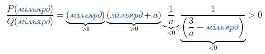

# Нерiвностi з параметрами

Точно так само, як і для рівнянь з параметрами, основна концепція при розв’язанні нерівностей з параметрами полягає в наступному:

<ol>
<li>Знайти «контрольнi» значення параметрiв, при яких у нерівності вiдбуваються якiснi змiни, наприклад, зміна знака на протилежний.</li>
<li>Знайти всi вирази для коренiв нерівності при рiзних значеннях параметрiв.</li>
</ol>

Приклад

Розв’язати нерівність $$\dfrac{x^2+3}{3-ax}>1$$. 

<ul class="nav-tab" id="mytab">
    <button class="btn" data-target="#decision" data-toggle="pill">Розв’язок</button>
    <button class="btn" data-target="#answer" data-toggle="pill">Вiдповiдь</button>
    <button class="btn" data-target="#hide" data-toggle="pill">Приховати</button>
</ul>

    

<b><i>Розв’язок</i></b>.

Перше «контрольне» значення параметра: $$a=0$$.

В такому випадку нерівність перетворюється на раціональну: $$\dfrac{x^2+3}{3}>1$$. Розв’яжемо її:

<table style="border: none;" class="none">
<tr>
<td>$$
    \begin{align}
        \dfrac{x^2 + 3}{3} & \gt 1 \\
        3 \cdot \dfrac{x^2 + 3}{3} & \gt 3 \cdot 1 \\
        x^2 + 3 & \gt 3 \\
        x^2 + 3 - 3 & \gt 3 - 3 \\
        x^2 & \gt 0 \\
        \sqrt{x^2} & \gt \sqrt{0} \\
        |x| & \gt 0 \\
        x & \in (-\infty;0)\cup(0;+\infty)
    \end{align}$$</td>
<td><i>Вихідна нерівність  Множимо обидві частини на $$3$$  Спрощуємо Віднімаємо $$3$$ від обох частин Спрощуємо Знаходимо квадратні корені обох частин Спрощуємо Записуємо розв'язок у інтервальному вигляді</i></td>
</tr>
</table>

Зображуємо розв’язок на числовій осі: 

Отже, при $$a=0$$ маємо $$x\in(-\infty;0)\cup(0;\infty)$$.

Розглядаємо тепер інші випадки, коли $$a\neq0$$.

У загальному випадку застосуємо метод інтервалів.

<ol>
<li>Зводимо нерівність до стандартного вигляду $$\dfrac{P(x)}{Q(x)}>0$$ або $$\dfrac{P(x)}{Q(x)}<0$$:</li>

<table style="border: none;" class="none">
<tr>
<td>$$
    \begin{align}
        \dfrac{x^2+3}{3 - ax} & \gt 1 \\
        \dfrac{x^2+3}{3-ax} - 1 & \gt 0 \\
        \dfrac{x^2+3}{3-ax} - \dfrac{3-ax}{3-ax} & \gt 0 \\
        \dfrac{x^2 + ax}{3-ax} & \gt 0
    \end{align}$$</td>
</tr>
</table>

<li>Шукаємо граничні точки, для цього розкладаємо многочлени з чисельника і знаменника на множники.</li>

В знаменнику все просто: $$3-ax = a\left(\dfrac{3}{a}-x\right)$$, в чисельнику: $$x^2+ax=x(x+a)$$.

Отже, нерівність можна переписати у вигляді:

$$\dfrac{P(x)}{Q(x)}=\dfrac{x(x+a)}{a\left(\dfrac{3}{a}-x\right)}>0$$

<li>Граничні точки чисельника: $$x=0,x=-a$$; знаменника: $$x=\dfrac{3}{a}$$</li>

Для того, щоб зобразити ці точки на числовій прямій, розглядаємо два випадки: 

<ul>
<li>$$a>0$$: тоді має місце співвідношення $$-a<0<\dfrac{3}{a}$$.</li>
<li>$$a<0$$: тоді має місце співвідношення $$\dfrac{3}{a}<0<-a$$.</li>
</ul>
<li>Шукаємо знак функції на правому інтервалі і потім проставляємо знаки решти інтервалів:</li>
<ul>
<li>$$a>0$$: підставляємо тестове значення з правого інтервалу $$\left(\dfrac{3}{a};\infty \right)$$ - «<i>мільярд</i>»</li>

Три множники додатні, один від’ємний – функція на цьому інтервалі має від’ємний знак.

Все, що потрібно зробити, – проставити знаки на решті інтервалів справа наліво, почергово змінюючи знак на протилежний:

<li>$$a<0$$: підставляємо тестове значення з правого інтервалу $$(-a;\infty)$$ - «<i>мільярд</i>»</li>

Два множники додатні, два від’ємні – функція на цьому інтервалі має додатний знак.

Все, що потрібно зробити, – проставити знаки на решті інтервалів справа наліво, почергово змінюючи знак на протилежний:

</ul>
<li>Залишилось обрати інтервали, де функція додатна, бо за умовою $$\dfrac{P(x)}{Q(x)}>0$$</li>
<ul>
<li>$$a>0$$: обираємо інтервали $$(-\infty;-a)$$ та $$\left(0;\dfrac{3}{a}\right)$$.</li>
<li>$$a<0$$: обираємо інтервали $$\left(\dfrac{3}{a};0\right)$$ та $$(-a;\infty)$$.</li>
</ul>
</ol>
    

    

<b>Вiдповiдь.</b> 
Запишемо загальний результат:

<ul>
<li>при $$a=0: x \in (-\infty;0) \cup (0;\infty);$$</li>
<li>при $$a>0: x \in (-\infty;-a) \cup \left(0;\dfrac{3}{a}\right)$$;</li>
<li>при $$a<0: x \in \left(\dfrac{3}{a};0\right) \cup (-a;\infty)$$.</li>
</ul>
    

    

<quiz correctLabel="correct" incorrectLabel="incorrect" checkLabel="check">
 <question multiple>
        
Які типи критичних значень параметра зустрінуться під час розв'язання нерівності $$\dfrac{(a-1)x^2-5x+10}{5(a-2)}>0$$?

        <answer correct> перетворення квадратичного виразу на лінійний</answer>
        <answer correct> рівність дискримінанту нулеві</answer>
        <answer correct> рівність знаменнику нулеві</answer>
        <answer> рівність підмодульного виразу нулеві</answer>
</question>
</quiz>