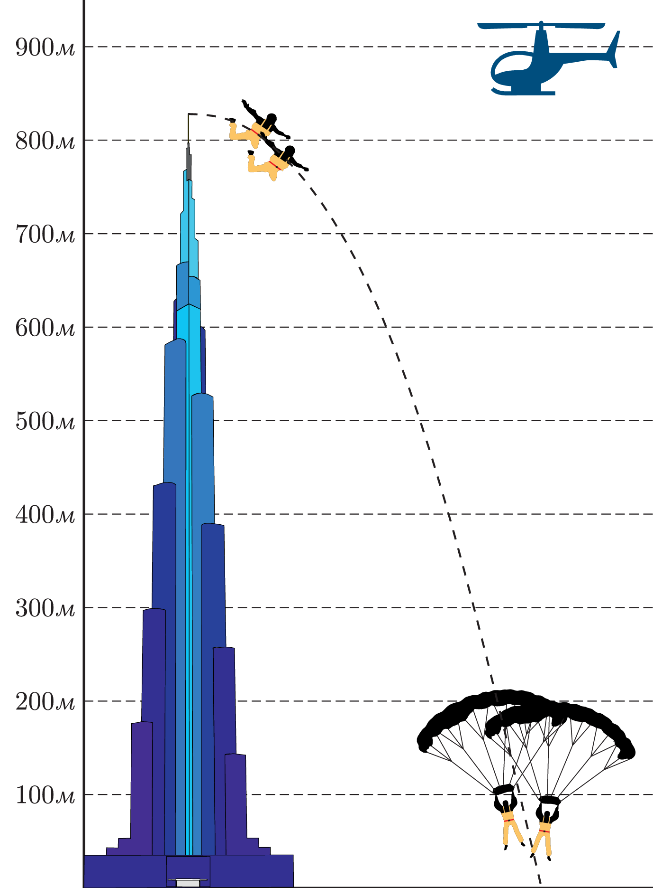
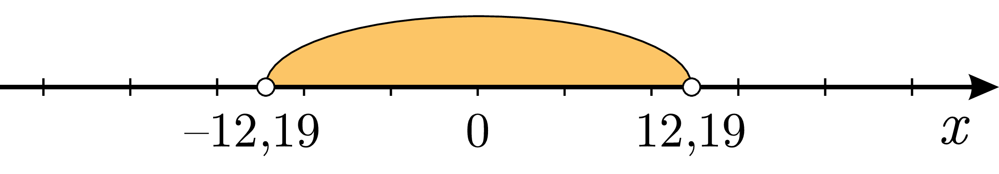

# Раціональні нерівності

Бурдж Халіфа – найвища споруда в світі, що розташована в місті Дубай, Об'єднані Арабські Емірати. Вона сягає $$828$$ метрів і складається зі $$162$$ поверхів. Вежу можна побачити з відстані $$90$$ км!

Бейс-джампінг – екстремальний вид спорту. B.A.S.E. – скорочення слів Building, Antenna, Span, Earth – об’єктів, з яких стрибають бейс-джампери. В $$2014$$ році двоє французьких джамперів Фред Ф'юген та Вінс Реффет встановили новий рекорд Гіннеса  - найвищий бейс-стрибок з будівлі – $$828$$ метрів. Вони стрибнули з самісінької кінцівки шпиля Бурдж-Халіфи.

Пропоную подивитися відеозапис стрибка. Вражає, чи не так?

<iframe align="center" width="560" height="315" src="https://www.youtube.com/embed/iD4qsWnjsNU" frameborder="0" allowfullscreen></iframe>

<iframe align="center" width="560" height="315" src="https://www.youtube.com/embed/PBmhpruaDpA" frameborder="0" allowfullscreen></iframe>

А тепер спробуємо описати цей стрибок математично. На примітивному рівні, звичайно. Висота Бурдж Халіфи – $$828$$ метрів. Залежність висоти від часу при вільному падінні описується квадратичною функцією:

$$h(t) = h_{0} + v_{0}t - \dfrac{gt^2}{2}$$

 $$g\approx9.8\hspace{0.1cm}\text{м}/\text{c}^2$$ – прискорення вільного падіння, $$h_{0}$$ – початкова висота, $$v_{0}$$ – початкова швидкість.

У випадку наших джамперів: $$h_{0} = 828\text{м}$$, $$v_{0} = 0\hspace{0.1cm}\text{м}/\text{c}$$

У результаті маємо:

$$h(t) = 828 - 4,9t^2$$

З відео можна помітити, що хлопці розкривають парашути на висоті близько $$100$$ метрів. За інформацією з інтернет-форумів для джамперів, стало зрозуміло, що ця висота є критичною: якщо розкрити парашут нижче, такий стрибок може стати фатальним.

Час, який є у джамперів для того, щоб розкрити парашут безпечно для життя, можна визначити з нерівності:

$$\begin{align} 
828 - 4,9t^2 &> 100 \nonumber \\ 
828 - 4,9t^2 - 100 &> 100 - 100 \nonumber \\ 
728 - 4,9t^2 &> 0 \nonumber \\ 
\dfrac{728}{-4,9} - \dfrac{4,9}{-4,9}t^2 &< 0 \nonumber \\ 
t^2 - 148,57 &< 0 \nonumber \\ 
(t - 12,19)(t + 12,19) &< 0 \nonumber  
\end{align}$$

Значення $$t=\pm12,19$$ перетворюють функцію в лівій частині нерівності на нуль і розбивають числову вісь на три проміжки:

Розглянемо знаки, які прийматимуть множники лівої частини:

<table>
<tr>
<td></td>
<td>$$(-\infty;-12,19)$$</td>
<td>$$(-12,19;12,19)$$</td>
<td>$$(12,19;\infty)$$</td>
</tr>
<tr>
<td>$$(t - 12,19)$$</td>
<td>$$-$$</td>
<td>$$-$$</td>
<td>$$+$$</td>
</tr>
<tr>
<td>$$(t + 12,19)$$</td>
<td>$$-$$</td>
<td>$$+$$</td>
<td>$$+$$</td>
</tr>
</table>

Відповідно вся ліва частина має знаки:

<table>
<tr>
<td></td>
<td>$$(-\infty;-12,19)$$</td>
<td>$$(-12,19;12,19)$$</td>
<td>$$(12,19;\infty)$$</td>
</tr>
<tr>
<td>$$(t - 12,19)(t + 12,19)$$</td>
<td>$$+$$</td>
<td>$$-$$</td>
<td>$$+$$</td>
</tr>
</table>

Бачимо, що при переході крізь точки $$-12,19;12,19$$ функція змінює свій знак.

Нам потрібен той інтервал, де функція є від’ємною – тобто $$t \in (-12,19;12,19)$$.

Тепер потрібно включити здоровий глузд і згадати, що час – величина невід’ємна (про квантову фізику та <a href="https://uk.wikipedia.org/wiki/%D0%9F%D1%80%D0%BE%D0%B1%D0%BB%D0%B5%D0%BC%D0%B0_2038_%D1%80%D0%BE%D0%BA%D1%83">проблему 2038 року</a> поговоримо якось іншим разом), тому треба накласти додаткову умову: $$t\geq0$$.

В результаті маємо підсумковий розв’язок:

$$t \in (0;12,19)$$ 

Отже, ці бентежні хлопці мали трохи більше, ніж $$12$$ секунд для того, щоб насолодитися вільним падінням безпечно для життя.

На перший погляд, це мало часу, але в нашому світі все відносне. Ось, наприклад, <a href="http://youtu.be/ORp2nzwHXN0">цей хлопчина</a> за той саме час ($$12,2$$ секунди) зробив $$165$$ оплесків долонями, а всього за хвилину – $$804$$! Також погляньте на <a href="http://youtu.be/eE3rxyC_FhI">ось таку підбірку</a> найшвидших збирань кубика Рубика. Вражає, чи не так? 

Тепер перейдемо до розгляду раціональних нерівностей.

Визначення

<b>Раціональна нерівність</b> — це нерівність вигляду $$P(x) > 0$$ або $$P(x) < 0$$ або $$P(x) \geq 0$$ або $$P(x) \leq 0$$, де $$P(x)$$ – многочлен, а $$x$$ – змінна.

<i>Наприклад:</i> $$x^2>0;\quad x^2-3>x;\quad(x-2)(x+3)(x-5)^2\leq0;\quad x^4-5x^3+x-7<10x^2.$$

<quiz correctLabel="correct" incorrectLabel="incorrect" checkLabel="check">
 <question text="">
        
Якою на вашу думку була швидкість стрибунів на момент відкриття парашуту?

        <answer>$$30$$ м/с</answer>
        <answer>$$60$$ м/с</answer>
        <answer>$$90$$ м/с</answer>
        <answer correct>$$120$$ м/с</answer>
</question>
</quiz>