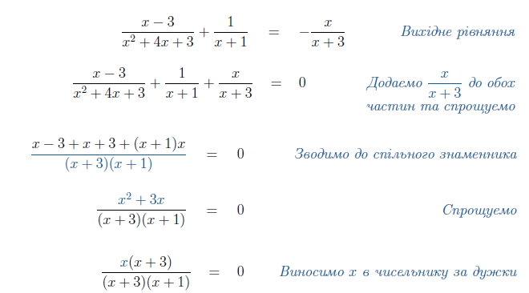
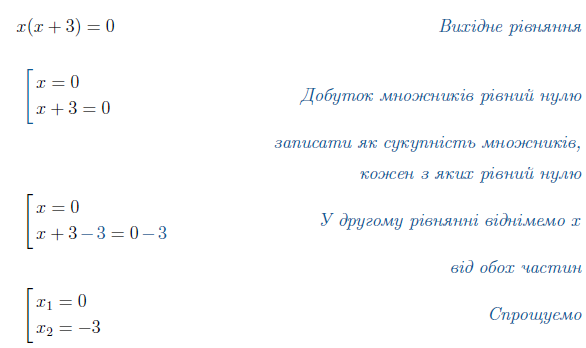
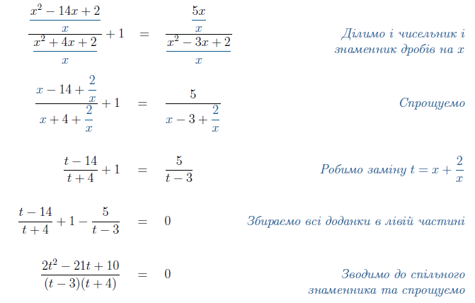
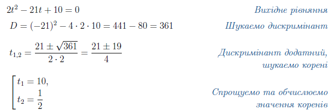

# Дробово-раціональне рівняння

Повернемося до вихідного рівняння. Воно містило змінну у знаменнику дробу, і таке рівняння називається дробовим раціональним.

Означення

<b>Дробово-раціональне рівняння</b> — це рівняння вигляду $$\dfrac{P(x)}{Q(x)} = 0$$, де $$P(x),Q(x)$$ – многочлени, а $$x$$ – змінна.

<i>Наприклад:</i> $$\dfrac{1}{x}=2;\quad \dfrac{x(x+3)}{x-1}=0;\quad \dfrac{5x^2+x+1}{3-x+x^3}-\dfrac{1}{x}=6.$$

Розв’язувати дробові раціональні рівняння не складніше, ніж звичайні раціональні. Головне – <b>пам’ятати про ОДЗ знаменника</b>.

Алгоритм <b>Дробове раціональне рівняння</b>

<ol>
<li>Виразити рівняння у вигляді $$\dfrac{P(x)}{Q(x)} = 0$$, де $$P(x),Q(x)$$ – многочлени.</li>
<li>Розв’язати рівняння $$P(x)=0$$.</li>
<li>Перевірити знайдені корені, аби вони задовольняли ОДЗ знаменника: $$Q(x_i)\neq0$$.</li>
</ol>

Приклад

Знайти корені рівняння $$\dfrac{x-3}{x^2+4x+3} + \dfrac{1}{x+1} = -\dfrac{x}{x+3}$$. 

<b><i>Розв’язок</i></b>.

Користуємося вищезазначеним алгоритмом.

<ol>
<li>Перетворюємо рівняння до вигляду $$\dfrac{P(x)}{Q(x)} = 0$$:</li>

<li>Розв’язуємо рівняння з чисельника:</li>

<li>Тепер поглянемо на знаменник. ОДЗ такого дробу знаходиться з умови\\ $$(x+3)(x+1)\neq0$$. Отже отримуємо ОДЗ: $$x\neq-3;x\neq-1$$.</li>

Серед знайдених двох коренів ОДЗ задовольняє лише один $$x=0$$.

</ol>
<b>Вiдповiдь.</b> $$x=0$$.

Приклад

Знайти корені рівняння $\dfrac{x^2-14x+2}{x^2+4x+2}+1=\dfrac{5x}{x^2-3x+2}$  

<b><i>Розв’язок</i></b>.

Перед нами дробове раціональне рівняння. Зводимо його до вигляду $$\dfrac{P(x)}{Q(x)} = 0$$.

Скористаємося одним трюком. Якщо уважно придивитися до коефіцієнтів квадратних тричленів у рівнянні, можна побачити, що деякі з них співпадають:

Якщо в такому рівняння поділити і чисельник і знаменник на $$x$$ – можна буде зробити дуже вдалу заміну. Але спочатку треба перевірити, чи не є $$x=0$$ коренем рівняння, бо на $$0$$ ділити не можна:

$$\dfrac{0^2-14\cdot0+2}{0^2+4\cdot0+2} +1 = \dfrac{5\cdot0}{0^2-3\cdot0+2}\Longleftrightarrow \dfrac{2}{2}+1=0$$

Така рівність не справджується, тому можна спокійно ділити і чисельник і знаменник дробів на $$x$$:

Розв’язуємо рівняння з чисельника:

Поглянемо на ОДЗ змінної, знаменник повинен бути відмінним від нуля: $$(t-3)(t+4)\neq0$$. Це даэ два заборонених значення змінної: $$t\neq3;t\neq-4$$. Обидва знайдені значення задовольняють ОДЗ.

<b>Вiдповiдь.</b> $$x=0$$.

