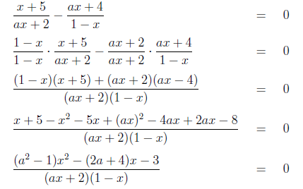
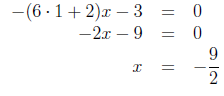
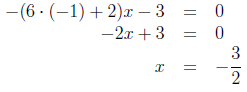
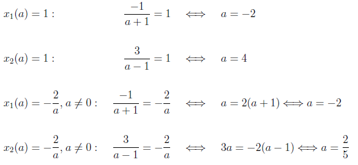

# Раціональні рівняння з параметрами

Точно так само, як і для інших видів рівнянь з параметрами, основна концепція при розв’язанні полягає у наступному: 

<ol>
<li>Знайти «контрольнi» значення параметрiв, при яких у рівнянні вiдбуваються якiснi змiни, наприклад, вираз у знаменнику обертається на нуль.</li>
<li>Знайти всi вирази для коренiв рiвняння при рiзних значеннях параметрiв.</li>
</ol>

Приклад

Розв’язати рівняння $$\dfrac{x+5}{ax+2}-\dfrac{ax+4}{1-x}=0$$. 

<b><i>Розв’язок</i></b>.

Маємо дробове раціональне рівняння.

Зводимо його до стандратного вигляду $$\dfrac{P(x)}{Q(x)} = 0$$:

$$(a^2-1) x^2-(2a+4)x-3=0$$

По-перше розглянемо «контрольні» значення параметру $$a=\pm1$$. Рівняння стане лінійним та матиме один корінь:

При $$a=1$$:

При $$a=-1$$:

Якщо $$a\neq\pm1$$, то рівняння є квадратним. Шукаємо дискримінант:

$$D=(2a+4)^2-4\cdot(a^2-1)\cdot(-3)=4a^2+16a+16+12a^2-12=$$

$$=16a^2+16a+4=4(4a^2+4a+1)=4(2a+1)^2\geq0$$

Наступну контрольну точку шукаємо з умови $$D=0$$:

$$4(2a+1)^2=0 \Longleftrightarrow 2a+1=0 \Longleftrightarrow a=-\dfrac{1}{2}$$

Шукаємо розв’язок при $$a=-\dfrac{1}{2}$$:

$$x=\dfrac{2\left(-\dfrac{1}{2} \right)+4}{2\left( \left(-\dfrac{1}{2} \right)^2-1 \right)}=-2$$

В решті випадків, коли $$a \notin \left\{-1;-\dfrac{1}{2};1 \right\}$$ рівняння має два корені:

$$x_{1,2} = \dfrac{2a+4\pm\sqrt{4(2a+1)^2}}{2(a^2-1)}=\dfrac{a+2\pm|2a+1|}{a^2-1}$$

Розглянемо два випадки для позбавлення значка модуля:

При $$a>-\dfrac{1}{2}$$:

$$x_1=\dfrac{a+2+(2a+1)}{a^2-1}=\dfrac{3a+3}{(a+1)(a-1)}=\dfrac{3(a+1)}{(a+1)(a-1)}=\dfrac{3}{a-1}$$

$x_2=\dfrac{a+2-(2a+1)}{a^2-1}=\dfrac{-a+1}{(a+1)(a-1)}=\dfrac{-1}{a+1}$

При $$a<-\dfrac{1}{2}$$:

$$x_1=\dfrac{a+2-(2a+1)}{a^2-1}=\dfrac{-a+1}{(a+1)(a-1)}=\dfrac{-1}{a+1}$$

$$x_2=\dfrac{a+2+(2a+1)}{a^2-1}=\dfrac{3a+3}{(a+1)(a-1)}=\dfrac{3(a+1)}{(a+1)(a-1)}=\dfrac{3}{a-1}$$

Бачимо, що корені на цих двох проміжках однакові, тому у відповіді будемо це записувати спільним інтервалом для параметра $$a$$:

При $$a \notin \left\{-1;-\dfrac{1}{2};1 \right\}$$:

$$x_1=\dfrac{-1}{a+1}$$

$$x_2=\dfrac{3}{a-1}$$

Єдине що залишилось – відкинути ті корені, що не входять в ОДЗ. Зі знаменника вихідного дробового рівняння

$$\dfrac{(a^2-1) x^2-(2a+4)x-3}{(ax+2)(1-x)}=0$$

отримуємо умову $$(ax+2)(1-x)\neq0$$. Отже ОДЗ: $$x\neq1;x\neq-\dfrac{2}{a},a\neq0$$.

Тепер головне – не заплутатись при відборі коренів. Для одного значення параметра $$a$$ квадратне рівняння дає нам два корені. Маючи ОДЗ для змінної $$x$$ та вирази для коренів ми можемо знайти саме ті значення параметра $a$, які дають заборонені значення змінної $$x$$. Такі значення параметра $$a$$ теж будуть «контрольними». Але, при цих «контрольних» значеннях один корінь є точно заборонений (звідки ми й знайшли це значення параметра), а ось другий, скоріше за все – ні (це треба перевірити).

В результаті, для більшості значень параметра $$a$$ у відповіді буде два кореня, а для таких «контрольних» значень – лише один (або жодного).

Зараз виконуємо таку послідовність дій:

<ol>
<li>Шукаємо «контрольні» значення параметра, що дають заборонені значення $$x$$.</li>
<li>Шукаємо дозволені значення другого (іншого з двох) кореня при «контрольних» значення параметра $$a$$.</li>
</ol>

Поїхали!

<ol>
<li>Шукаємо «контрольні» значення параметра $$a$$. Для цього прирівняємо знайдені вирази для коренів по черзі забороненим значенням $$x$$, та звідти виразимо $$a$$:</li>

Знайшли три «контрольних» значення параметра $$a: -2;4;\dfrac{2}{5}$$.

<li>Шукаємо тепер дозволені значення $$x$$ при «контрольних» значення параметра:</li>
<ul>
<li>При $$a=-2$$:</li>

$$x_1 (-2)=1$$ – заборонене значення, шукаємо $$x_2$$:

$$x_2 (-2)=\dfrac{3}{-2-1}=-1\neq1$$ – дозволене значення.

<li>При $$a=4$$:</li>

$$x_2 (4)=1$$ – заборонене значення, шукаємо $$x_1$$:

$$x_1 (4)=\dfrac{-1}{4+1}=-\dfrac{1}{5}\neq1$$ – дозволене значення.

<li>При $$a=\dfrac{2}{5}$$:</li>

$$x_2 \left(\dfrac{2}{5}\right)=\dfrac{3}{\dfrac{2}{5}-1}=-5$$ – заборонене значення, шукаємо $$x_1$$:

$$x_1 \left(\dfrac{2}{5}\right)=\dfrac{-1}{\dfrac{2}{5}+1}=-\dfrac{5}{7}\neq-5$$ – дозволене значення.

</ul>
</ol>

Тепер головне не заплутатись і перерахувати всі розглянуті випадки:

<b>Вiдповiдь.</b> $$x=0$$.

