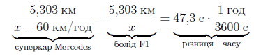
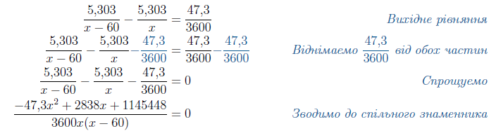
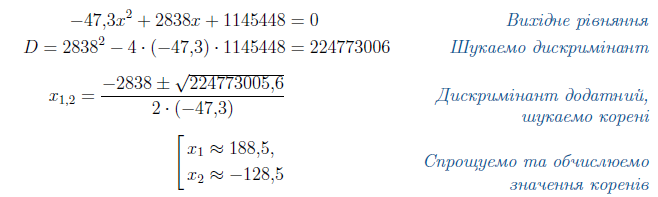

# Дробово-раціональні рівняння
# Загальні відомості

<iframe align="center" width="560" height="315" src="https://www.youtube.com/embed/lWDbWYuzBno" frameborder="0" allowfullscreen></iframe>

Одне з найшвидших серійних авто у світі – Mercedes-AMG C63 — може з місця прискоритись до $$100$$ км/год за $$4,1$$ с, маючи при цьому максимальну швидкість $$250$$ км/год.

А тепер погляньте на болід Ferrari гоночної серії Формула $$1$$.

Цей красень зривається з місця до $$100$$ км/год за $$1,7$$ с, до $$200$$ км/год за $$3,8$$ с та має максимальну швидкість приблизно $$350$$ км/год! Неймовірно, чи не так?

Уявіть, яку перевагу болід Формули $$1$$ матиме на трасі над суперкаром Mercedes.

Ось це відео – чудова демонстрація цьому.

<iframe align="center" width="560" height="315" src="https://www.youtube.com/embed/3RuUp5MT3Uc" frameborder="0" allowfullscreen></iframe>

Додамо трошки математики.

Траса Ґран-Прі Формули $$1$$ «Альберт Парк» у Мельбурні, Австралія, завдовжки  $$5303$$ метри. Болід Формули $$1$$ пройшов повне коло на $$47,3$$ с швидше за Mercedes. При цьому середня швидкість Mercedes на одному колі була на $$60$$ км/год меншою. Якщо представити середню швидкість на колі як $$x$$, тоді час проходження одного кола можна описати таким чином:

<!--

-->

$$\underbrace{\dfrac{5,303\thinspace км}{x\thinspace -\thinspace 60\thinspace км/год}}_{суперкар\thinspace Mercedes}$$ $$-$$ $$\underbrace{\dfrac{5,303\thinspace км}{x}}_{болід\thinspace F1}$$ $$=$$ $$\underbrace{47,3\thinspace с\thinspace \cdot \dfrac{1\thinspace год}{3600\thinspace с}}_{різниця\thinspace часу}$$ 

Тепер можна відшукати середню швидкість боліда F$$1$$.

Зведемо всі доданки до спільного знаменника:

<!--

-->

<table style="border: none;" class="none">
<tr>
<td align="center">$$\dfrac{5,303}{x-60} - \dfrac{5,303}{x} = \dfrac{47,3}{3600}$$</td>
<td><i>Вихідне рівняння</i></td>
</tr>
<tr>
<td align="center">$$\dfrac{5,303}{x-60} - \dfrac{5,303}{x} \color{#1570bd}- \dfrac{\color{#1570bd}47\color{#1570bd},\color{#1570bd}3}{\color{#1570bd}3\color{#1570bd}6\color{#1570bd}0\color{#1570bd}0} = \dfrac{47,3}{3600} \color{#1570bd}- \dfrac{\color{#1570bd}47\color{#1570bd},\color{#1570bd}3}{\color{#1570bd}3\color{#1570bd}6\color{#1570bd}0\color{#1570bd}0}$$</td>
<td><i>Віднімаємо $$\dfrac{47,3}{3600}$$ від обох частин</i></td>
</tr>
<tr>
<td align="center">$$\dfrac{5,303}{x-60} - \dfrac{5,303}{x} - \dfrac{47,3}{3600} = 0$$</td>
<td><i>Спрощуємо</i></td>
</tr>
<tr>
<td align="center">$$\dfrac{-47,3x^2 + 2838x + 1145448}{3600x(x - 60)} = 0$$</td>
<td><i>Зводимо до спільного знаменника</i></td>
</tr>
</table>

Маємо раціональний дріб. Пригадаємо умову рівності дробу нулеві (див. розділ 5 <a href="http://math.ed-era.com/4/drobovo-ratsionalni_virazi.html">Корінь та його властивості</a>):

$$\begin{cases} 
M=0\\ 
N \neq 0 
\end{cases} \Longrightarrow \dfrac{M}{N} = 0$$

Почнемо з <b>першої умови</b> і розв’язуємо рівняння з чисельника:

<!--

-->

<table style="border: none;" class="none">
<tr>
<td align="center">$$\dfrac{5,303}{x-60} - \dfrac{5,303}{x} = \dfrac{47,3}{3600}$$</td>
<td><i>Вихідне рівняння</i></td>
</tr>
<tr>
<td align="center">$$2838^2 - 4\cdot (-47,3)\cdot 1145448 = 224773006$$</td>
<td><i>Шукаємо дискримінант</i></td>
</tr>
<tr>
<td align="center">$$\dfrac{-2838\pm \sqrt{224773005,6}}{2\cdot (-47,3)} = 0$$</td>
<td><i>Дискримінант додатний, шукаємо корені</i></td>
</tr>
<tr>
<td align="center">$$\left[
    \begin{array}{}
        x_1 \approx 188,5 \\
        x_2 \approx -128,5
    \end{array}
    \right.$$</td>
<td><i>Спрощуємо та обчислюємо значення коренів</i></td>
</tr>
</table>

<b>Друга умова</b>: перевіряємо знайдені корені на відповідність ОДЗ – при цих значеннях знаменник не повинен дорівнювати нулеві. Зі знаменника легко побачити, що ОДЗ: $$x\neq0,x\neq60$$. Знайдені корені цю умову задовольняють.

З двох знайдених коренів залишаємо тільки додатне значення швидкості боліда з точки зору здорового глузду.

Таким чином, середня швидкість на колі боліда F$$1$$ склала $$188,5$$ км/год, а суперкара Mercedes AMG C$$65$$ – на $$60$$ км/год менше, тобто $$128,5$$ км/год.

Формула $$1$$ є найбільш інноваційним та технологічно розвиненим видом автоспорту. Середня швидкість в гонці є найбільшою серед всіх гоночних серій. Цього вдається досягти за допомогою використання переднього та заднього антикрил, а також ідеального аеродинамічного профілю, що на високих швидкостях дають притисну силу в $$3000$$ кг для боліда вагою всього-на-всього $$650$$ кг.

Дуже раджу подивитись випуск програми «Інженерні ідеї з Річардом Хамондом» про Формулу $$1$$:

<iframe align="center" width="560" height="315" src="https://www.youtube.com/embed/e4AS2kZnHk0" frameborder="0" allowfullscreen></iframe>
