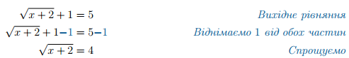
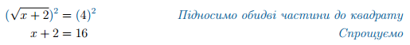

# Iррацiональнi рiвняння з квадратним коренем

Означення

<b>Ірраціональне рівняння</b> — це рівняння, що містить змінну під знаком кореня, або в дробовому степені.

<i>Наприклад,</i> $$\sqrt{x}+1=2;\sqrt{x+1}-\sqrt[3]{x}=x^2;x^{\frac{2}{3}}=x+1.$$

Розпочнемо з найпростіших рівнянь, що містять змінну під знаком квадратного кореня, і такий доданок лише один. Наприклад, $$\sqrt{x+2}+1=5$$.

Основний принцип розв'язання такого рівняння базується на властивості квадратного кореня:

$$(\sqrt{a})^2=a.$$

Для того, щоб скористатися цією властивістю потрібно <b>залишити доданок з коренем в одній частині рівняння, а решту доданків зібрати в іншій</b>. Тому такий метод отримав назву метод відкоремлення кореня.

Тепер час скористатися вищезгаданою властивістю.

Вуаля. Страшний корінь раптом зник, і ми маємо звичайне рівняння.

Алгоритм

<ol>
<li>Залишити доданок з коренем в одній частині рівняння, а решту доданків зібрати в іншій.</li>
<li>Піднести до квадрату обидві частини рівняння та спростити.</li>
<li>Розв’язати отримане рівняння. Якщо дане рівняння містить доданки з коренем – повторити кроки 1-2.</li>
<li>Перевірити отримані розв’язки підстановкою у вихідне рівняння.</li>
</ol>

