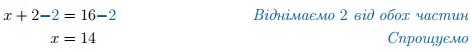

# Iррацiональнi рiвняння з квадратним коренем

Означення

<b>Ірраціональне рівняння</b> — це рівняння, що містить змінну під знаком кореня, або в дробовому степені.

<i>Наприклад,</i> $$\sqrt{x}+1=2;\sqrt{x+1}-\sqrt[3]{x}=x^2;x^{\frac{2}{3}}=x+1.$$

Розпочнемо з найпростіших рівнянь, що містять змінну під знаком квадратного кореня, і такий доданок лише один. Наприклад, $$\sqrt{x+2}+1=5$$.

Основний принцип розв'язання такого рівняння базується на властивості квадратного кореня:

$$(\sqrt{a})^2=a.$$

Для того, щоб скористатися цією властивістю потрібно <b>залишити доданок з коренем в одній частині рівняння, а решту доданків зібрати в іншій</b>. Тому такий метод отримав назву метод відкоремлення кореня.

<table style="border: none;" class="none">
<tr>
<td>$$\sqrt{x+2} + 1 = 5$$</td>
<td><i>Вихідне рівняння</i></td>
</tr>
<tr>
<td>$$\sqrt{x+2} + 1 \color{#0F5181}- \color{#0F5181}1 = 5 \color{#0F5181}- \color{#0F5181}1$$</td>
<td><i>Віднімаємо</i> 1 <i>від обох частин</i></td>
</tr>
<tr>
<td>$$\sqrt{x+2} = 4$$</td>
<td><i>Спрощуємо</i></td>
</tr>
</table>

Тепер час скористатися вищезгаданою властивістю.

<table style="border: none;" class="none">
<tr>
<td>$$\color{#0F5181}(\sqrt{x+2}\color{#0F5181})^\color{#0F5181}2 = \color{#0F5181}(4\color{#0F5181})^\color{#0F5181}2$$</td>
<td><i>Підносимо обидві частини до квадрату</i></td>
</tr>
<tr>
<td>$$x+2 = 16$$</td>
<td><i>Спрощуємо</i></td>
</tr>
</table>

Вуаля. Страшний корінь раптом зник, і ми маємо звичайне рівняння.

Алгоритм

<ol>
<li>Залишити доданок з коренем в одній частині рівняння, а решту доданків зібрати в іншій.</li>
<li>Піднести до квадрату обидві частини рівняння та спростити.</li>
<li>Розв’язати отримане рівняння. Якщо дане рівняння містить доданки з коренем – повторити кроки 1-2.</li>
<li>Перевірити отримані розв’язки підстановкою у вихідне рівняння.</li>
</ol>

Приклад

Розв’язати рівняння $$2\sqrt{2x+1}-5x+2=x$$.

Розв’язок.

<ol>
<li>Залишаємо доданок з коренем на самоті в лівій частині рівняння:</li>

<li>Підносимо обидві частини рівняння до квадрату:</li>

<li>Розв’язуємо отримане рівняння:</li>

Перевіряємо отримані розв’язки:

</ol>

Відповідь: $$x=\dfrac{8}{9}$$.

Побічні корені

За визначенням значення квадратного кореня є завжди додатним. Ця властивість дозволяє швидко оцінити рівняння на наявність коренів. Якщо, раптово, зустрінеться рівняння вигляду

$$\sqrt{20-3x}=-20$$

то одразу, не розв'язуючи його можна сказати, що таке рівняння коренів не має. Значення доданку з квадратним коренем не може бути від’ємним $$\sqrt{20-3x} \geq0$$, і тому $$x\in\emptyset$$.

Але якщо ми піднесемо обидві частини рівняння до квадрату (слідуючи алгоритму розв’язання):

$$20-3x=400$$

таке рівняння, на відміну від попереднього, вже має корінь і його значення: $$x=-\dfrac{380}{3}$$.

Такий корінь називають <b>побічним</b>. Він з’явився після піднесення обох частин рівняння до квадрату. Це пов’язано з тим, що рівняння $$20-3x=400$$ можна отримати піднесенням до квадрату як рівняння $$\sqrt{20-3x}=-20$$, так і рівняння $$\sqrt{20-3x}=20$$.

Аналогічно, в попередньому прикладі $$x=0$$ був побічним коренем рівняння. Він не пройшов перевірку підстановкою у вихідне рівняння, і був відсіяний. Тому, будьте уважними під час перевірки знайдених коренів.

