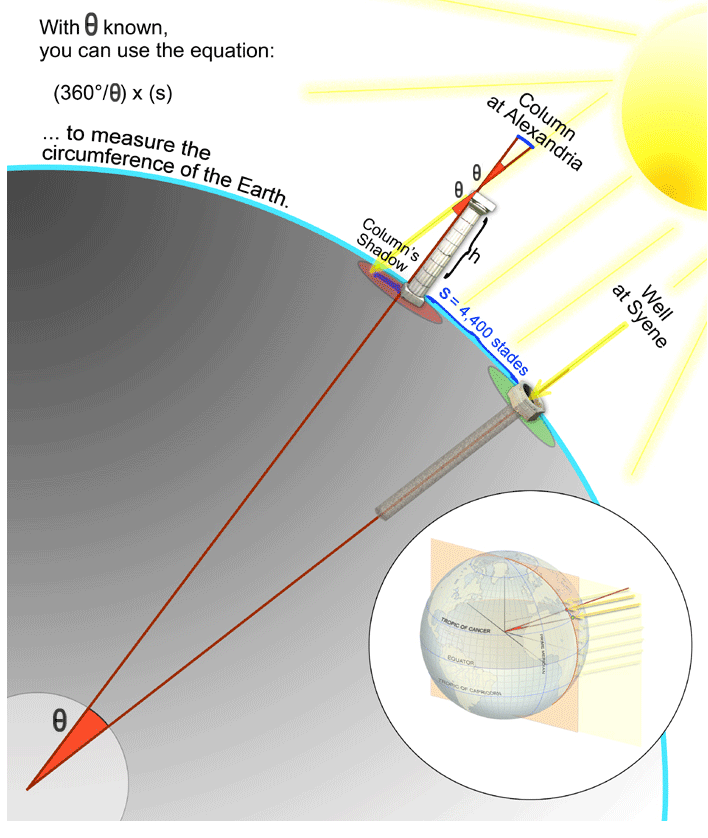

# Ірраціональні рівняння

Дуже давно, у другому сторіччі до нашої ери, в Олександрії жив давньогрецький вчений на ім’я Ератосфен. Колеги звали його Beta (друга літера грецького алфавіту), бо, як вони казали: «Ератосфен був другим найкращим у світі у всьому, за що він брався». Астроном, історик, географ, філософ, поет, театральний критик і математик, він також був головою Великої Олександрійської бібліотеки. Він помітив цікавий факт: у єгипетському місті Сієни (зараз – Асуан) один раз на рік, 19 червня опівдень, всі предмети перестають відкидати тінь, а відбиток сонця можна побачити на дні колодязів.

Мало хто звертав увагу на такі дрібниці, але не Ератосфен. Рік потому, знаходячись у той самий день у Олександрії, яка знаходиться на узбережжі Середземного моря (північніше Сієни), Ератосфен побачив, що тут, на відміну від Сієни, предмети відкидають тінь.

Він задався питанням: як так може бути, щоб в один і той самий момент колона у Олександрії відкидає тінь, а у Сієнах – ні? Тоді Ератосфен надійшов висновку, що Земля має форму кулі, і навіть зміг досить точно обчислити довжину екватора. Він виміряв довжину тіні, і, знаючи висоту колони, визначив, що кут між сонячними променями та колоною складає 7,2° (в той час, як в Сієнах цей кут є нульовим). Ератосфен також найняв спеціалістів-землемірів, які кроками встановили відстань між двома містами – вона склала близько 800 км. Якщо подивитись на Землю у перерізі, то сектор у 7,2° - це 1/50 повного кола. Тому, для визначення довжини екватору, Ератосфен помножив відстань між містами на 50 і отримав 40 000 км, що лише на 120 км (0,3%!) відрізняється від справжнього значення. І це, маючи лише примітивні вимірювальні прилади!
