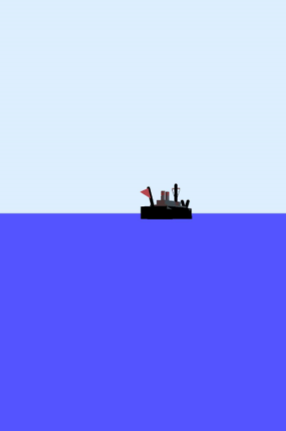
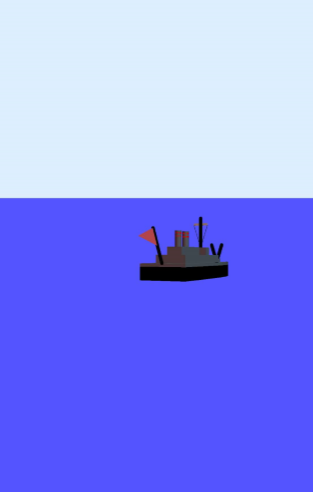

# Корабель на горизонтi

Чи помічали ви колись, стоячі на березі, як кораблі, що відпливають далеко, досягають лінії горизонту, а потім зникають за нею? Наступного разу пропоную виконати такий експеримент: як тільки корабль сховається за горизонт, підніміться на якийсь невеличкий пагорб, чи останній поверх будинку – і ви знову побачите той самий корабль.

$$\quad$$$$\quad$$$$\quad$$$$\quad$$
  

Чому так стається? Причина така сама, як у Сієнської «аномалії» Ератосфена – наша планета Земля є круглою.

Якщо зобразити Михайла, що стоїть на поверхні Землі, максимальна відстань, на яку він бачитиме (тобто відстань до горизонту) буде окреслювати коло навколо нього.

Розмір цього кола безпосередньо залежить від висоти спостерігання – чим вище знаходиться спостерігач, тим далі він бачить:

$$d\approx3,85\sqrt{h},$$

де h - висота спостерігача у метрах, а d відстань до горизонту у кілометрах. Цю формулу можна отримати, застосувавши теорему Піфагора. Детальніше, <a href="http://planetcalc.ru/1198/">тут</a>.

Для звичайної людини зростом 175 см лінія горизонту лежить на відстані 5 км.

Щоби відповісти на питання «А на яку відстань треба піднятись, аби побачити на 20 км?» потрібно розв’язати рівняння:

$$20 = 3,85\sqrt{h}.$$

Давайте піднесемо обидві частини рівняння до квадрату аби позбавитися значка кореня:

<table style="border: none;" class="none">
<tr>
<td>$$20 = 3,85\sqrt{h}$$</td>
<td><i>Вихідне рівняння</i></td>
</tr>
<tr>
<td>$$\dfrac{20}{\color{#1570bd}3\color{#1570bd},\color{#1570bd}8\color{#1570bd}5} = \dfrac{3,85}{\color{#1570bd}3\color{#1570bd},\color{#1570bd}8\color{#1570bd}5}\sqrt{h}$$</td>
<td><i>Ділимо обидві частини рівняння на</i> 3,85</td>
</tr>
<tr>
<td>$$5,2 = \sqrt{h}$$</td>
<td><i>Спрощуємо</i></td>
</tr>
<tr>
<td>$$\color{#1570bd}(5,2\color{#1570bd})^\color{#1570bd}2 = \color{#1570bd}(\sqrt{h}\color{#1570bd})^\color{#1570bd}2$$</td>
<td><i>Підносимо обидві частини до квадрату</i></td>
</tr>
<tr>
<td>$$27= h$$</td>
<td><i>Спрощуємо</i></td>
</tr>
</table>

Отже ми отримали висоту 27м – це висота дев’ятиповерхового будинку. Піднявшись на висоту в шістнадцять разів більшу можна побачити лише в чотири рази далі.

Під час розв’язання цієї задачі ми вперше зустрілись з ірраціональним рівнянням.

