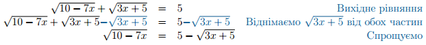
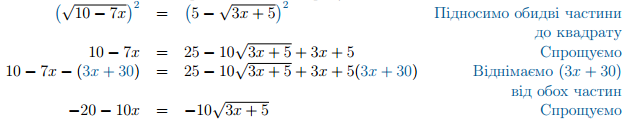
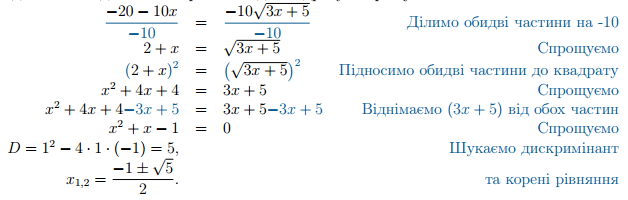

# Корабль поза горизонтом

Повернемося до корабля на горизонті, що віддаляється. Як тільки він відпливе від вас на $$5$$ км – він візуально торкнеться лінії горизонту. При подальшому віддаленні, корабль почне поступово ховатися за лінією горизонту, і, згодом, зникне повністю.

$$\quad$$$$\quad$$$$\quad$$$$\quad$$
  

Відстань, на якій корабль повністю сховається називають дальністю видимості, і залежить вона, від вашої висоти та від висоти корабля. Якщо до Михайла на Землі домалювати Марічку на кораблі, то все стане зрозуміло:

Дальність видимості — це сума відстані до горизонту Михайла та відстані до горизонту Марічки:

$$D\approx3,85(\sqrt{h}+\sqrt{H}),$$

де $$h$$ - висота спостерігача у метрах, $$H$$ – висота об’єкту, що спостерігається, а D – дальність видимості у кілометрах.

Приклад

Михайло стоїть на узбережжі Чорного моря та спостерігає у підзорну трубу за Марічкою, що знаходиться на палубі корабля. Коли корабль відплив на відстань $$38,5$$ км від берега – Марічка зникла за лінією горизонту. На якій висоті спостерігав Михайло, якщо Марічка стояла на $$5$$ метрів вище?

Розв’язок.

Скористаємося рівнянням для визначення дальності спостереження $$D\approx3,85(\sqrt{h}+\sqrt{H})$$. Тоді за висоту Михайла приймемо $$h=x$$ метрів, висоту Марічки $$H=(x+5)$$ метрів та дальність спостереження $$D=38,5$$ км. Отримане рівняння

$$3,85(\sqrt{x}+\sqrt{x+5})=38,5$$

розв’язуємо за допомогою стандартного алгоритму:

<ol>
<li>Залишаємо доданок з коренем на самоті в лівій частині рівняння:</li>
<table style="border: none;" class="none">
<tr>
<td>$$3,85(\sqrt{x} + \sqrt{x+5}) = 38,5$$</td>
<td><i>Вихідне рівняння</i></td>
</tr>
<tr>
<td>$$\dfrac{3,85}{\color{#1570bd}3\color{#1570bd},\color{#1570bd}8\color{#1570bd}5}(\sqrt{x} + \sqrt{x+5}) = \dfrac{38,5}{\color{#1570bd}3\color{#1570bd},\color{#1570bd}8\color{#1570bd}5}$$</td>
<td><i>Ділимо обидві частини на $$3,85$$</i></i></td>
</tr>
<tr>
<td>$$\sqrt{x} + \sqrt{x+5} = 10$$</td>
<td><i>Спрощуємо</i></td>
</tr>
<tr>
<td>$$\sqrt{x} + \sqrt{x+5} \color{#1570bd}- \sqrt{\color{#1570bd}x} = 10 \color{#1570bd}- \sqrt{\color{#1570bd}x}$$</td>
<td><i>Віднімаємо $$\sqrt{x}$$ від обох частин</i></td>
</tr>
<tr>
<td>$$\sqrt{x+5} = 10 - \sqrt{x}$$</td>
<td><i>Спрощуємо</i></td>
</tr>
</table>

<li>Підносимо обидві частини рівняння до квадрату:</li>

<table style="border: none;" class="none">
<tr>
<td>$$\color{#1570bd}(\sqrt{x+5}\color{#1570bd})^\color{#1570bd}2 = \color{#1570bd}(\sqrt{10-x}\color{#1570bd})^\color{#1570bd}2$$</td>
<td><i>Підносимо обидві частини до квадрату</i></td>
</tr>
<tr>
<td>$$x + 5 = 100 - 20\sqrt{x} + x$$</td>
<td><i>Спрощуємо</i></i></td>
</tr>
<tr>
<td>$$x + 5 \color{#1570bd}- \color{#1570bd}x \color{#1570bd}- \color{#1570bd}5 = 100 - 20\sqrt{x} + x \color{#1570bd}- \color{#1570bd}x \color{#1570bd}- \color{#1570bd}5$$</td>
<td><i>Віднімаємо $$x+5$$ від обох частин</i></td>
</tr>
<tr>
<td>$$0 = 95 - 20\sqrt{x}$$</td>
<td><i>Спрощуємо</i></td>
</tr>
</table>

<li>Отримане рівняння знову містить значок кореня. Повторюємо кроки 1 та 2. Залишаємо доданок з коренем на самоті в лівій частині рівняння. Потім підносимо обидві частини рівняння до квадрату і спрощуємо:</li>

<table style="border: none;" class="none">
<tr>
<td>$$0 \color{#1570bd}+ \color{#1570bd}2\color{#1570bd}0\sqrt{\color{#1570bd}x} = 95 - 20\sqrt{x} \color{#1570bd}+ \color{#1570bd}2\color{#1570bd}0\sqrt{\color{#1570bd}x}$$</td>
<td><i>Додаємо $$20\sqrt{x}$$ до обох частин</i></td>
</tr>
<tr>
<td>$$20\sqrt{x} = 95$$</td>
<td><i>Спрощуємо</i></i></td>
</tr>
<tr>
<td>$$\dfrac{20}{\color{#1570bd}2\color{#1570bd}0}\sqrt{x} = \dfrac{95}{\color{#1570bd}2\color{#1570bd}0}$$</td>
<td><i>Ділимо обидві частини на $$20$$</i></td>
</tr>
<tr>
<td>$$\sqrt{x} = \dfrac{19}{4}$$</td>
<td><i>Спрощуємо</i></td>
</tr>
<tr>
<td>$$\color{#1570bd}(\sqrt{x}\color{#1570bd})^\color{#1570bd}2 = \color{#1570bd}(\dfrac{19}{4}\color{#1570bd})^\color{#1570bd}2$$</td>
<td><i>Підносимо обидві частини до квадрату</i></td>
</tr>
<tr>
<td>$$x = \dfrac{361}{16}$$</td>
<td><i>Спрощуємо</i></td>
</tr>
</table>

<li>Перевіримо отриманий розв’язок підстановкою у вихідне рівняння</li>

<table style="border: none;" class="none">
<tr>
<td>$$3,85(\sqrt{x} + \sqrt{x+5}) \ = \ 38,5$$</td>
<td><i>Вихідне рівняння</i></td>
</tr>
<tr>
<td>$$3,85 \left(\sqrt{\dfrac{\color{#1570bd}3\color{#1570bd}6\color{#1570bd}1}{\color{#1570bd}1\color{#1570bd}6}} + \sqrt{\dfrac{\color{#1570bd}3\color{#1570bd}6\color{#1570bd}1}{\color{#1570bd}1\color{#1570bd}6} + 5}\right) = \ ? 38,5$$</td>
<td><i>Підставляємо $$\dfrac{361}{16}$$ замість $$x$$</i></i></td>
</tr>
<tr>
<td>$$\sqrt{\dfrac{\color{#1570bd}3\color{#1570bd}6\color{#1570bd}1}{\color{#1570bd}1\color{#1570bd}6}} + \sqrt{\dfrac{\color{#1570bd}3\color{#1570bd}6\color{#1570bd}1}{\color{#1570bd}1\color{#1570bd}6} + 5} \ = \ ? 10$$</td>
<td><i></i></td>
</tr>
<tr>
<td>$$\dfrac{19}{4} + \sqrt{\dfrac{441}{16}} \ = \ ?10$$</td>
<td><i></i></td>
</tr>
<tr>
<td>$$\dfrac{19}{4} + \dfrac{21}{4} \ = \ ?10$$</td>
<td><i></i></td>
</tr>
<tr>
<td>$$10 \ = \ 10$$</td>
<td><i>Вірно</i></td>
</tr>
</table>

</ol>

Отже Михайло знаходився на висоті, трошки більшій, ніж $$22,5$$ метри.

<b>Відповідь</b>: $$22.5$$ метри

Перевірка коренів та ОДЗ

В попередніх прикладах ми завжди робили перевірку знайдених коренів підстановкою. Це пов’язано з тим, що піднесення рівняння до <b>парного степеня</b> спричиняє появу побічних коренів, які, звичайно, треба відсіяти. При піднесенні рівняння до непарного степеня таку підстановку можна не робити.

Але інколи рівняння є громіздкими і від перевірки підстановкою стає «дуже болісно». В цих випадках стає в нагоді знаходження ОДЗ рівняння окремо, а потім перевірка знайдених коренів на відповідність допустимим значенням.

В квадратних рівняннях може виникнути два типи обмеження ОДЗ, які виникають безпосередньо з визначення арифметичного кореня:

<ul>
<li>підкореневий вираз не може бути від’ємним</li>
<li>значення кореня не може бути від’ємним</li>
</ul>

З цих двох умов можна скласти систему нерівностей для змінної рівняння, і, розв’язавши її, отримати ОДЗ.

Після цього залишається лише перевірити знайдені корені рівняння на відповідність ОДЗ, і підставляти в рівняння вже нічого не треба.

Ще раз наголошую, що це стосується лише коренів парного степеня. Для коренів непарного степеня нічого подібного робити не потрібно – просто розв’язати рівняння і все.

Приклад

Розв’язати рівняння $$\sqrt{10-7x}+\sqrt{3x+5}=5$$.

Розв’язок:

Знайдемо область допустимих значень рівняння. Пам’ятаємо, що підкореневі вирази завжди невід’ємні для кореня парного степеня, тому складаємо систему нерівностей:

$$\begin{cases}
			10-7x\geq0,\\
			3x+5\geq0
			\end{cases} \Longleftrightarrow \begin{cases}
			x\leq\dfrac{10}{7},\\
			x\geq-\dfrac{5}{3}
			\end{cases} \Longleftrightarrow -\dfrac{5}{3}\leq x\leq\dfrac{10}{7}$$

ОДЗ готове.

Отже, зі знайдених далі розв’язків ми залишимо лише ті, що потрапляють у інтервал $$\left[-\dfrac{5}{3};\dfrac{10}{7}\right]$$.

Тепер розв’язуємо саме рівняння за стандартним алгоритмом:

<ol>
<li>Залишаємо доданок з коренем на самоті в лівій частині рівняння:</li>

<li>Підносимо обидві частини рівняння до квадрату:</li>

<li>Отримане рівняння знову містить значок кореня. Повторюємо кроки 1 та 2. Залишаємо доданок з коренем на самоті в правій частині рівняння. Потім підносимо обидві частини рівняння до квадрату і спрощуємо:</li>

<li>Тепер перевіряємо корені на відповідність ОДЗ замість підстановки.
Для цього потрібно прикинути значення коренів. Квадратний корінь з $$5$$ – ірраціональне число. Ми точно знаємо, що воно лежить між $$2$$ і $$3$$, бо $$2^2=4$$, а $$3^2=9$$. при чому набагато ближче до $$2$$. Візьмемо приблизно $$2,2$$:</li>

$$x_1 \approx \dfrac{-1-2,2}{2}=-1,6,$$

$$x_2 \approx \dfrac{-1+2,2}{2}=0,6.$$

</ol>

За ОДЗ корені мусять лежати приблизно в межах від $$-1,66$$ до $$1,4$$.Наші обидва знайдені значення потрапляють у дозволений інтерал, тому є коренями вихідного рівняння.

Відповідь: $$x_{1,2} = \dfrac{-1\pm \sqrt{5}}{2}$$.

