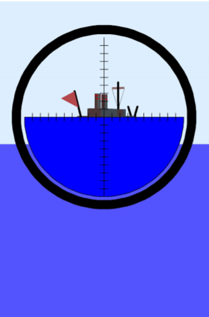
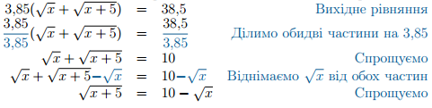
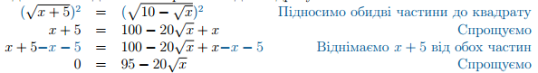
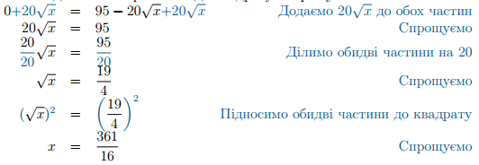
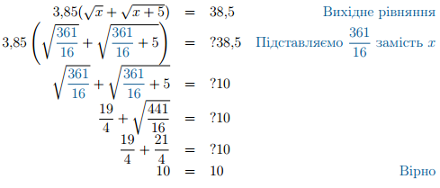

# Корабль поза горизонтом

Повернемося до корабля на горизонті, що віддаляється. Як тільки він відпливе від вас на $$5$$ км – він візуально торкнеться лінії горизонту. При подальшому віддаленні, корабль почне поступово ховатися за лінією горизонту, і, згодом, зникне повністю.

$$\quad$$$$\quad$$$$\quad$$$$\quad$$
  

Відстань, на якій корабль повністю сховається називають дальністю видимості, і залежить вона, від вашої висоти та від висоти корабля. Якщо до Михайла на Землі домалювати Марічку на кораблі, то все стане зрозуміло:

Дальність видимості — це сума відстані до горизонту Михайла та відстані до горизонту Марічки:

$$D\approx3,85(\sqrt{h}+\sqrt{H}),$$

де $$h$$ - висота спостерігача у метрах, $$H$$ – висота об’єкту, що спостерігається, а D – дальність видимості у кілометрах.

Приклад

Михайло стоїть на узбережжі Чорного моря та спостерігає у підзорну трубу за Марічкою, що знаходиться на палубі корабля. Коли корабль відплив на відстань $$38,5$$ км від берега – Марічка зникла за лінією горизонту. На якій висоті спостерігав Михайло, якщо Марічка стояла на $$5$$ метрів вище?

Розв’язок.

Скористаємося рівнянням для визначення дальності спостереження $$D\approx3,85(\sqrt{h}+\sqrt{H})$$. Тоді за висоту Михайла приймемо $$h=x$$ метрів, висоту Марічки $$H=(x+5)$$ метрів та дальність спостереження $$D=38,5$$ км. Отримане рівняння

$$3,85(\sqrt{x}+\sqrt{x+5})=38,5$$

розв’язуємо за допомогою стандартного алгоритму:

<ol>
<li>Залишаємо доданок з коренем на самоті в лівій частині рівняння:</li>

<li>Підносимо обидві частини рівняння до квадрату:</li>

<li>Отримане рівняння знову містить значок кореня. Повторюємо кроки 1 та 2. Залишаємо доданок з коренем на самоті в лівій частині рівняння. Потім підносимо обидві частини рівняння до квадрату і спрощуємо:</li>

<li>Перевіримо отриманий розв’язок підстановкою у вихідне рівняння</li>

</ol>

Отже Михайло знаходився на висоті, трошки більшій, ніж $$22,5$$ метри.

<b>Відповідь</b>: $$22.5$$ метри

Перевірка коренів та ОДЗ

В попередніх прикладах ми завжди робили перевірку знайдених коренів підстановкою. Це пов’язано з тим, що піднесення рівняння до <b>парного степеня</b> спричиняє появу побічних коренів, які, звичайно, треба відсіяти. При піднесенні рівняння до непарного степеня таку підстановку можна не робити.

Але інколи рівняння є громіздкими і від перевірки підстановкою стає «дуже болісно». В цих випадках стає в нагоді знаходження ОДЗ рівняння окремо, а потім перевірка знайдених коренів на відповідність допустимим значенням.

В квадратних рівняннях може виникнути два типи обмеження ОДЗ, які виникають безпосередньо з визначення арифметичного кореня:

<ul>
<li>підкореневий вираз не може бути від’ємним</li>
<li>значення кореня не може бути від’ємним</li>
</ul>

З цих двох умов можна скласти систему нерівностей для змінної рівняння, і, розв’язавши її, отримати ОДЗ.

Після цього залишається лише перевірити знайдені корені рівняння на відповідність ОДЗ, і підставляти в рівняння вже нічого не треба.

Ще раз наголошую, що це стосується лише коренів парного степеня. Для коренів непарного степеня нічого подібного робити не потрібно – просто розв’язати рівняння і все.

