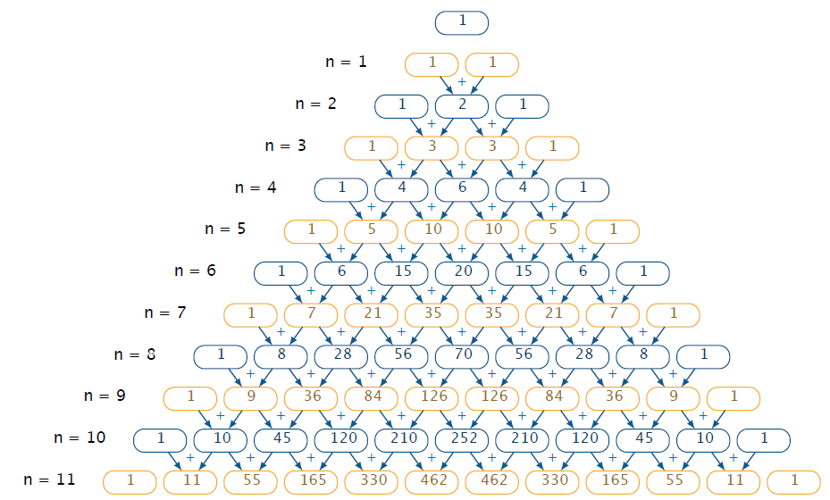

# Біном Ньютона

Визначення 

Сума вигляду $$(a+b)^n$$ називається біномом Ньютона та обчислюється за наступною формулою:

$$(a+b)^n = a^n + \gamma_1 a^{n-1}b + \gamma_2 a^{n-2}b^2 + \dots + \gamma_{n-2} a^2 b^{n-2} + \gamma_{n-1} a b^{n-1} + b^n,$$

де коефіцієнти розкладу $$\gamma_1, \dots, \gamma_n$$– елементи $$n$$-го рядка трикутнику Паскаля.

Трикутник Паскаля запам’ятовувати не потрібно, треба лише знати, як його побудувати. Кожен рядок починається та закінчується одиницею, і має на один елемент більше, ніж попередній. Всі числа між ними отримуються складанням двох чисел, які стоять над даним (ліворуч і праворуч). Наприклад, для  $$(a+b)^7$$ коефіцієнти розкладу беремо з сьомого рядка трикутника Паскаля:

<iframe align="center" width="560" height="315" src="https://www.youtube.com/embed/VgtTYaI_t28" frameborder="0" allowfullscreen></iframe>

<i>Наприклад:</i> $$(a+b)^7=a^7+7a^6 b+21a^5 b^2+35a^4 b^3+35a^3 b^4+21a^2 b^4+7ab^6+b^7.$$

Приклад

Знайти номер члена розкладу бінома $$(\sqrt[3]{x} + \dfrac{1}{x})^{16}$$, який не містить $$x$$.

<ul class="nav-tab" id="mytab">
<button class="btn" data-target="#decision" data-toggle="pill">Розв’язок</button>
<button class="btn" data-target="#answer" data-toggle="pill">Вiдповiдь</button>
<button class="btn" data-target="#hide" data-toggle="pill">Приховати</button>
</ul>

  

<b><i>Розв’язок.</i> </b> 

Що ж, для спільного члена розкладу маємо формулу: $$\gamma_n (\sqrt[3]{x})^{16-n} (\dfrac{1}{x})^n$$

Загалом, значення $$\gamma_n$$ для нас не має вагомої ролі, тому перемножимо $$(\sqrt[3]{x})^{16-n}$$ і $$(\dfrac{1}{x})^n$$ і знайдемо їх значення:

$$(\sqrt[3]{x})^{16-n} \cdot (\dfrac{1}{x})^n \rightarrow $$$$ x^{\frac{16-n}{3}} \cdot x^{-n} \rightarrow x^{\frac{16-4n}{3}}$$

Отже, коли $$16-4n=0 \rightarrow n = 4$$, ми отримаємо, що $$x^0 = 1$$ і значення цього члену не буде залежати від $$x$$.

  

  

<b>Вiдповiдь.</b> $$4$$

  

  

<quiz correctLabel="correct" incorrectLabel="incorrect" checkLabel="check">
    <question text="">
        
Обчислити: $$(5-3)^3$$

        <answer> $$5$$</answer>
        <answer> $$3$$</answer>
        <answer correct> $$8$$</answer>
        <answer> $$7$$</answer>
        <answer> $$11$$</answer>
        <explanation>
        
$$(5-3)^3=5^3 + 3\cdot5^2\cdot(-3) + 3\cdot5\cdot(-3)^2 + (-3)^3 =5\cdot5\cdot5 + 3\cdot5\cdot5\cdot(-3) +$$
 
        
$$+ 3\cdot5\cdot(-3)\cdot(-3) + (-3)\cdot(-3)\cdot(-3)=125-225+135-27=8$$

        </explanation>
    </question>
    <question text="">
        
Вказати коефіцієнти для 6-го ступеня у трикутнику Паскаля:

        <answer> $$1, 4, 6, 4, 1$$</answer>
        <answer> $$1, 5, 10, 10, 5, 1$$</answer>
        <answer correct> $$1, 6, 15, 20, 15, 6, 1$$</answer>
        <answer> $$1, 7, 21, 35, 35, 21, 7 ,1$$</answer>
    </question>
</quiz>