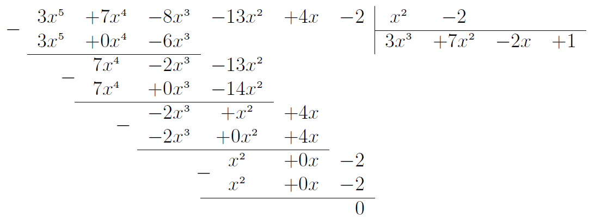

# Дії над многочленами

<ul>
<li>
<b>Додавання/віднімання</b>. Потрібно розкрити дужки та звести подібні доданки. Якщо перед дужками стоїть знак «+», то знаки дужок лишаються незмінними; якщо  «-», то знаки всередині дужок слід замінити на протилежні.
</li>

<i>Наприклад:</i> $$(4x^2 y + xy) + (x - 6 - xy) = 4x^2 y + xy + x - 6 - xy = 4x^2 y + x - 6.$$ $$(4x^2 y + xy) - (x - 6 - xy) = 4x^2 y + xy - x + 6 + xy = 4x^2 y + 2xy + x + 6.$$

<li>
<b>Множення одночлена на многочлен</b>. Потрiбно одночлен помножити на кожний доданок многочлена i додати отриманi добутки.
</li>

<i>Наприклад:</i> $$(4x^2 y - xy)\cdot(-3y^3)=4x^2 y\cdot(-3y^3) + (-xy)\cdot(-3y^3 ) = -12x^2 y^4 + 3xy^4.$$

<li>
<b>Множення многочлена на многочлен</b>. Потрiбно кожен доданок одного многочлена помножити на кожен доданок другого многочлена i додати отриманi добутки.
</li>

<i>Наприклад:</i> $$(4x^2 y-xy)\cdot(x-6-xy)=4x^2 y\cdot x+(-xy)\cdot x+4x^2 y\cdot(-6)+(-xy)\cdot$$ $$\cdot(-6)+4x^2 y\cdot(-xy)+(-xy)\cdot(-xy)=4x^3 y-x^2 y-24x^2 y+6xy-4x^3 y^2+x^2 y^2=$$ $$=-4x^3 y^2+4x^3 y+x^2 y^2-25x^2 y+6xy.$$

<li>
<b>Ділення многочлена на одночлен.</b> Потрібно кожен доданок многочлена поділити на одночлен і додати отримані частки.
</li>

<i>Наприклад:</i> $$(4x^5y-2x^3y^3+8xy^2+6xy):(2xy) = (4x^5y):(2xy) - (2x^3y^3):(2xy)+$$ $$+ (8xy^2):(2xy) + (6xy):(2xy) = 2x^4 - x^2y^2 + 4y + 3.$$

<li>
<b>Ділення многочлена на многочлен</b>. Потрібно виконати ділення за правилом кута:

    
1. Привести многочлени до стандартного вигляду.

    
2. Поділити старший додаток діленого на старший додаток дільника.

    
3. Записати отриманий одночлен як доданок у результат.

    
4. Помножити дільник на отриманий одночлен та відняти цей добуток від діленого.

    
5. Повторювати кроки $$1-4$$ доки не залишиться в остачі нуль або степінь остачі не стане меншим від степеня дільника.

    

    
<i>Наприклад:</i> $$3x^5+7x^4-8x^3-13x^2+4x-2$$ на многочлен $$x^2 - 2$$:
</li>
</ul>

<table class="td" style="border: none;">
  <tr>
    <td style="border-bottom:1pt solid black;" class="td-s6z2"></td>
    <td class="td-s6z2">3x</td>
    <td class="td-s6z2">+</td>
    <td class="td-s6z2">7x</td>
    <td class="td-s6z2">-</td>
    <td class="td-s6z2">8x</td>
    <td class="td-s6z2">-</td>
    <td class="td-s6z2">13x</td>
    <td class="td-s6z2">+</td>
    <td class="td-s6z2">4x</td>
    <td class="td-s6z2">-</td>
    <td style="border-width: 2px; border-right:1pt solid black;" class="td-s6z2">2</td>
    <td style="border-width: 2px; border-bottom:1pt solid black;" class="td-s6z2">x</td>
    <td style="border-width: 2px; border-bottom:1pt solid black;" class="td-s6z2">-</td>
    <td style="border-width: 2px; border-bottom:1pt solid black;" class="td-s6z2">2</td>
    <td style="border-width: 2px; border-bottom:1pt solid black;" class="td-s6z2"></td>
    <td style="border-width: 2px; border-bottom:1pt solid black;" class="td-s6z2"></td>
  </tr>
  <tr>
    <td class="td-s6z2"></td>
    <td style="border-width: 2px; border-bottom:1pt solid black;" class="td-s6z2">3x</td>
    <td style="border-width: 2px; border-bottom:1pt solid black;" class="td-s6z2">+</td>
    <td style="border-width: 2px; border-bottom:1pt solid black;" class="td-s6z2">0x</td>
    <td style="border-width: 2px; border-bottom:1pt solid black;" class="td-s6z2">-</td>
    <td style="border-width: 2px; border-bottom:1pt solid black;" class="td-s6z2">6x</td>
    <td class="td-s6z2"></td>
    <td class="td-s6z2"></td>
    <td class="td-s6z2"></td>
    <td class="td-s6z2"></td>
    <td class="td-s6z2"></td>
    <td style="border-width: 2px !important; border-right:1pt solid black;" class="td-s6z2"></td>
    <td class="td-s6z2">3x</td>
    <td class="td-s6z2">+</td>
    <td class="td-s6z2">7x</td>
    <td class="td-s6z2">-</td>
    <td class="td-s6z2">2x</td>
  </tr>
  <tr>
    <td class="td-s6z2"></td>
    <td class="td-s6z2"></td>
    <td style="border-width: 2px !important; border-bottom:1pt solid black;" class="td-s6z2"></td>
    <td class="td-s6z2">7x</td>
    <td class="td-s6z2">-</td>
    <td class="td-s6z2">2x</td>
    <td class="td-s6z2">-</td>
    <td class="td-s6z2">13x</td>
    <td class="td-s6z2"></td>
    <td class="td-s6z2"></td>
    <td class="td-s6z2"></td>
    <td class="td-s6z2"></td>
    <td class="td-s6z2"></td>
    <td class="td-s6z2"></td>
    <td class="td-s6z2"></td>
    <td class="td-s6z2"></td>
    <td class="td-s6z2"></td>
  </tr>
  <tr>
    <td class="td-s6z2"></td>
    <td class="td-s6z2"></td>
    <td class="td-s6z2"></td>
    <td style="border-width: 2px; border-bottom:1pt solid black;" class="td-s6z2">7x</td>
    <td style="border-width: 2px; border-bottom:1pt solid black;" class="td-s6z2">+</td>
    <td style="border-width: 2px; border-bottom:1pt solid black;" class="td-s6z2">0x</td>
    <td style="border-width: 2px; border-bottom:1pt solid black;" class="td-s6z2">-</td>
    <td style="border-width: 2px; border-bottom:1pt solid black;" class="td-s6z2">14x</td>
    <td class="td-s6z2"></td>
    <td class="td-s6z2"></td>
    <td class="td-s6z2"></td>
    <td class="td-s6z2"></td>
    <td class="td-s6z2"></td>
    <td class="td-s6z2"></td>
    <td class="td-s6z2"></td>
    <td class="td-s6z2"></td>
    <td class="td-s6z2"></td>
  </tr>
  <tr>
    <td class="td-s6z2"></td>
    <td class="td-s6z2"></td>
    <td class="td-s6z2"></td>
    <td class="td-s6z2"></td>
    <td style="border-width: 2px; border-bottom:1pt solid black;" class="td-s6z2"></td>
    <td class="td-s6z2">-2x</td>
    <td class="td-s6z2">+</td>
    <td class="td-s6z2">x</td>
    <td class="td-s6z2">+</td>
    <td class="td-s6z2">4x</td>
    <td class="td-s6z2"></td>
    <td class="td-s6z2"></td>
    <td class="td-s6z2"></td>
    <td class="td-s6z2"></td>
    <td class="td-s6z2"></td>
    <td class="td-s6z2"></td>
    <td class="td-s6z2"></td>
  </tr>
  <tr>
    <td class="td-s6z2"></td>
    <td class="td-s6z2"></td>
    <td class="td-s6z2"></td>
    <td class="td-s6z2"></td>
    <td class="td-s6z2"></td>
    <td style="border-width: 2px; border-bottom:1pt solid black;" class="td-s6z2">-2x</td>
    <td style="border-width: 2px; border-bottom:1pt solid black;" class="td-s6z2">+</td>
    <td style="border-width: 2px; border-bottom:1pt solid black;" class="td-s6z2">0x</td>
    <td style="border-width: 2px; border-bottom:1pt solid black;" class="td-s6z2">+</td>
    <td style="border-width: 2px; border-bottom:1pt solid black;" class="td-s6z2">4x</td>
    <td class="td-s6z2"></td>
    <td class="td-s6z2"></td>
    <td class="td-s6z2"></td>
    <td class="td-s6z2"></td>
    <td class="td-s6z2"></td>
    <td class="td-s6z2"></td>
    <td class="td-s6z2"></td>
  </tr>
  <tr>
    <td class="td-s6z2"></td>
    <td class="td-s6z2"></td>
    <td class="td-s6z2"></td>
    <td class="td-s6z2"></td>
    <td class="td-s6z2"></td>
    <td class="td-s6z2"></td>
    <td style="border-width: 2px; border-bottom:1pt solid black;" class="td-s6z2"></td>
    <td class="td-s6z2">x</td>
    <td class="td-s6z2">+</td>
    <td class="td-s6z2">0x</td>
    <td class="td-s6z2">-</td>
    <td class="td-s6z2">2</td>
    <td class="td-s6z2"></td>
    <td class="td-s6z2"></td>
    <td class="td-s6z2"></td>
    <td class="td-s6z2"></td>
    <td class="td-s6z2"></td>
  </tr>
  <tr>
    <td class="td-s6z2"></td>
    <td class="td-s6z2"></td>
    <td class="td-s6z2"></td>
    <td class="td-s6z2"></td>
    <td class="td-s6z2"></td>
    <td class="td-s6z2"></td>
    <td class="td-s6z2"></td>
    <td style="border-width: 2px; border-bottom:1pt solid black;" class="td-s6z2">$$x$$</td>
    <td style="border-width: 2px; border-bottom:1pt solid black;" class="td-s6z2">$$+$$</td>
    <td style="border-width: 2px; border-bottom:1pt solid black;" class="td-s6z2">$$0x$$</td>
    <td style="border-width: 2px; border-bottom:1pt solid black;" class="td-s6z2">$$-$$</td>
    <td style="border-width: 2px; border-bottom:1pt solid black;" class="td-s6z2">$$2$$</td>
    <td class="td-s6z2"></td>
    <td class="td-s6z2"></td>
    <td class="td-s6z2"></td>
    <td class="td-s6z2"></td>
    <td class="td-s6z2"></td>
  </tr>
  <tr>
    <td class="td-s6z2"></td>
    <td class="td-s6z2"></td>
    <td class="td-s6z2"></td>
    <td class="td-s6z2"></td>
    <td class="td-s6z2"></td>
    <td class="td-s6z2"></td>
    <td class="td-s6z2"></td>
    <td class="td-s6z2"></td>
    <td class="td-s6z2"></td>
    <td class="td-s6z2"></td>
    <td class="td-s6z2"></td>
    <td class="td-s6z2">$$0$$</td>
    <td class="td-s6z2"></td>
    <td class="td-s6z2"></td>
    <td class="td-s6z2"></td>
    <td class="td-s6z2"></td>
    <td class="td-s6z2"></td>
  </tr>
</table>

<!--

-->

<quiz correctLabel="correct" incorrectLabel="incorrect" checkLabel="check">
    <question text="">
        
Знайдіть суму двох многочленів: $$(-3a^2b + 4ab + a) - (-3a^2b + 18ab + a - 5b)$$

        <answer>$$2a + b$$</answer>
        <answer>$$-14ab + 2a + 5b$$</answer>
        <answer correct>$$-14ab + 5b$$</answer>
        <answer>$$2a + 5b + 6a^b$$</answer>
        <answer>$$6a^2b + 5b$$</answer>
        <explanation>
        
$$(-3a^2b + 4ab + a) -$$$$ (-3a^2b +18ab + a - 5b) =$$$$ -3a^2b + 4ab + a +$$$$ 3a^2b - 18ab - a +$$$$ 5b = -14ab + 5b$$

        </explanation>
    </question>
    <question text="">
        
Знайдіть добуток двох многочленів: $$(xy^2 - x + y)\cdot(x^2y + 2x - 5y)$$

        <answer>$$x^3y^3-5xy^3-x^3y-2x^2-5y^2$$</answer>
        <answer correct>$$x^3y^3+3x^2y^2+7xy-5xy^3-x^3y-2x^2-5y^2$$</answer>
        <answer>$$x^3y^3+3x^2y^2+7xy-5xy^3-x^3y-2x^2$$</answer>
        <answer>$$5x^3y^3+3x^2y^2-7xy-5xy^3-x^3y-2x^2-5y^2$$</answer>
        <answer>$$x^3y^3+3x^2y^2+7xy-5xy^3+x^3y-2x^2+y^2$$</answer>
        <explanation>
        
$$(xy^2 - x + y)\cdot(x^2y + 2x - 5y) = xy^2\cdot x^2y + xy^2\cdot2x + xy^2\cdot(-5y) - x\cdot x^2y - x\cdot2x -$$

$$- x\cdot(-5y) + y\cdot x^2y + y\cdot2x + y\cdot(-5y) = x^3y^3 + 2x^2y^2 - 5xy^3 - x^3y - 2x^2 + 5xy +$$
 
$$+ x^2y^2+ 2xy - 5y^2 = x^3y^3 + 3x^2y^2 + 7xy - 5xy^3 - x^3y - 2x^2 - 5y^2$$

        </explanation>
    </question>
</quiz>