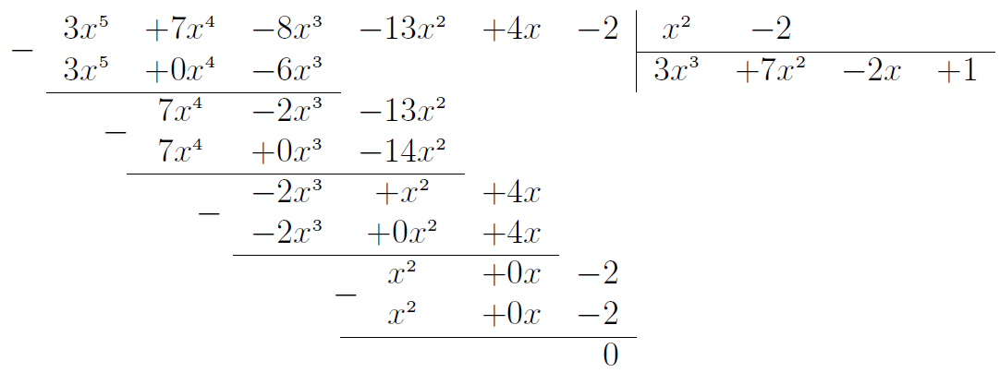

# Дії над многочленами

* 
<b>Додавання/віднімання</b>. Потрібно рокрити дужки та звести подібні доданки. Якщо перед дужками стоїть знак $$"$$+$$"$$, то знаки дужок лишаються незмінними; якщо  $$"$$-$$"$$, то знаки всередині дужок слід замінити на протилежні.

<i>Наприклад:</i> $$(4x^2 y + xy) + (x - 6 - xy) = 4x^2 y + xy + x - 6 - xy = 4x^2 y + x - 6.$$ $$(4x^2 y + xy) - (x - 6 - xy) = 4x^2 y + xy - x + 6 + xy = 4x^2 y + 2xy + x - 6.$$
 
* 
<b>Множення одночлена на многочлен</b>. Потрiбно одночлен помножити на кожний доданок многочлена i додати отриманi добутки.

<i>Наприклад:</i> $$(4x^2 y - xy)\cdot(-3y^3)=4x^2 y\cdot(-3y^3) + (-xy)\cdot(-3y^3 ) = -12x^2 y^4 + 3xy^4.$$
 
* 
<b>Множення многочлена на многочлен</b>. Потрiбно кожен доданок одного многочлена помножити на кожен доданок другого многочлена i додати отриманi добутки.

<i>Наприклад:</i> $$(4x^2 y-xy)\cdot(x-6-xy)=4x^2 y\cdot x+(-xy)\cdot x+4x^2 y\cdot(-6)+(-xy)\cdot$$ $$\cdot(-6)+4x^2 y\cdot(-xy)+(-xy)\cdot(-xy)=4x^3 y-x^2 y-24x^2 y+6xy-4x^3 y^2+x^2 y^2=$$ $$=-4x^3 y^2+4x^3 y+x^2 y^2-25x^2 y+6xy.$$
 
* 
<b>Ділення многочлена на одночлен.</b> Потрібно кожен доданок многочлена поділити на одночлен і додати отримані частки.

<i>Наприклад:</i> $$(4x^5y-2x^3y^3+8xy^2+6xy):(2xy) = (4x^5y):(2xy) - (2x^3y^3):(2xy)+$$ $$+ (8xy^2):(2xy) + (6xy):(2xy) = 2x^4 - x^2y^2 + 4y + 3.$$
 
* 
<b>Ділення многочлена на многочлен</b>. Потрібно виконати ділення за правилом кута:

    
1. Привести многочлени до стандартного вигляду.

    
2. Поділити старший додаток діленого на старший додаток дільника.

    
3. Записати отриманий одночлен як доданок у результат.

    
4. Помножити дільник на отриманий одночлен та відняти цей добуток від діленого.

    
5. Повторювати кроки $$1-4$$ доки не залишиться в остачі нуль або степінь остачі не стане меншим від степеня дільника.

    
<i>Наприклад:</i> $$3x^5+7x^4-8x^3-13x^2+4x-2$$ на многочлен $$x^2 - 2$$:

