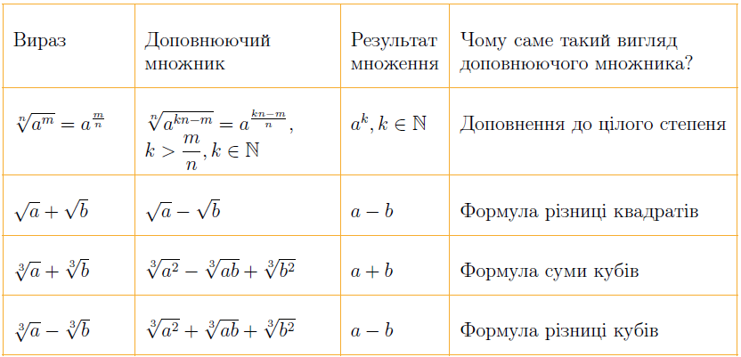

# Доповнюючі множники для основних типів ірраціональностей у знаменнику (чисельнику)

Перший рядок – доповнюючий множник знаходимо шляхом доповнення до цілого степеня, а наступні три виводимо з формул скороченого множення.

Приклад

Звільнитися від ірраціональності у знаменнику дробу: a) $$\dfrac{25}{\sqrt[6]{x^2+x+1}}$$; б) $$\dfrac{\sqrt x}{\sqrt{x}+1}$$;

в) $$\dfrac{x}{\sqrt[3]{2x+5}+3}$$.

<b><i>Розв’язок.</i></b>

a) $$\dfrac{25}{\sqrt[6]{x^2+x+1}}=\dfrac{25\cdot\sqrt[6]{(x^2+x+1)^5}}{\sqrt[6]{x^2+x+1}\cdot\sqrt[6]{(x^2+x+1)^5}}=\dfrac{25\cdot\sqrt[6]{(x^2+x+1)^5}}{x^2+x+1}$$;

б) $$\dfrac{\sqrt x}{\sqrt{x}+1}=\dfrac{\sqrt{x}\cdot(\sqrt{x}-1)}{(\sqrt{x}+1)\cdot(\sqrt{x}-1)}=\dfrac{\sqrt{x}\cdot(\sqrt{x}-1)}{x-1}$$;

в) $$\dfrac{x}{\sqrt[3]{2x+5}+3} = \dfrac{x}{\sqrt[3]{2x+5}+\sqrt[3]{27}} = \dfrac{x\cdot(\sqrt[3]{(2x+5)^2}-\sqrt[3]{27(2x+5)}+\sqrt[3]{27^2})}{(\sqrt[3]{2x+5}+\sqrt[3]{27})\cdot(\sqrt[3]{(2x+5)^2}-\sqrt[3]{27(2x+5)}+\sqrt[3]{27^2})} =$$

$$= \dfrac{x\cdot(\sqrt[3]{(2x+5)^2}-3\sqrt[3]{(2x+5)}+9)}{2x+5+27} = \dfrac{x\cdot(\sqrt[3]{(2x+5)^2}-3\sqrt[3]{(2x+5)}+9)}{2x+32}$$.

<b>Вiдповiдь.</b>a) $$\dfrac{25\cdot\sqrt[6]{(x^2+x+1)^5}}{x^2+x+1}$$; б) $$\dfrac{\sqrt{x}\cdot(\sqrt{x}-1)}{x-1}$$; в) $$\dfrac{x\cdot(\sqrt[3]{(2x+5)^2}-3\sqrt[3]{(2x+5)}+9)}{2x+32}$$.

