#Лiнiйнi нерiвностi

Означення

<b>Лінійна нерівність з однією змінною</b> — це нерівність вигляду $$a\cdot x > b$$ або $$a\cdot x < b$$ або $$a\cdot x \geq b$$ або $$a\cdot x \leq b$$, де $$x$$ – змінна, а числа $$a$$ і $$b$$ – відомі.

Повернемося до нашого прикладу з мобільним зв’язком: Скільки Мб інтернет-трафіку може використати Сашко з бюджетом $$75$$ грн.? На це питання можна відповісти, розв’язавши нерівність

$$40 + 0,05x \leq 75$$

відносно змінної $$x$$. Метод розв’язання майже такий самий, як і для рівняння

$$40 + 0,05x = 75$$

Нашою метою є <b>залишити $$x$$ «на самоті» в лівій частині</b>:

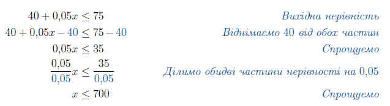

Отже, на місяць, маючи $$75$$ грн і тариф «Шалений день», Сашко може витрачати $$700$$ МБ мобільного інтернету. Ми розпочали з нерівності $$40+0,05x\leq75$$ та перейшли до рівносильної нерівності $$x\leq700$$.

Алгоритм <b>Pозв’язання лінійних нерівностей</b>

<ol>
<li>Спростити обидві частини нерівності.</li>
<li>Зібрати всі доданки, що містять $$x$$ в одній частині нерівності (як правило лівій), а всі вільні доданки – в іншій.</li>
<li>Розділити обидві частини нерівності на коефіцієнт при змінній $$x$$.</li>
<li>Записати відповідь в інтервальному представленні та зобразити її на числовій прямій.</li>
</ol>

Приклад

Розв’язати нерівність: $$3x < 8$$.

<b><i>Розв’язок</i></b>.

Спрощувати тут вже нема чого, всі доданки з $$x$$ в лівій частині, вільні доданки – у правій. Переходимо відразу до пункту <b>$$3$$</b>: необхідно розділити обидві частини нерівності на коефіцієнт при змінній $$x$$ та спростити отриманий вираз.

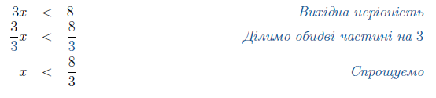

Єдине, що залишилось – записати відповідь в інтервальному представленні та зобразити її на числовій прямій:

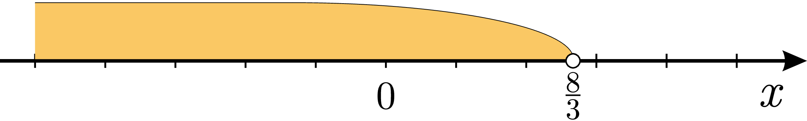

<b>Вiдповiдь.</b> $$x \in (-\infty;\dfrac{8}{3})$$.

Приклад

Розв’язати нерівність: $$-2\leq2-4x$$.

<b><i>Розв’язок</i></b>.

Всі доданки з $$x$$ вже розміщені в правій частині, збираємо всі вільні доданки в лівій:

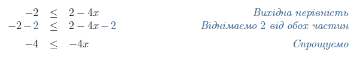

Ділимо обидві частини на коефіцієнт при змінній:

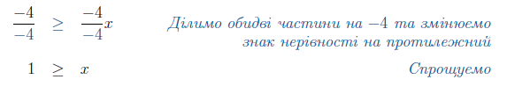

Тепер записуємо відповідь в інтервальному представленні та зображаємо її на числовій прямій:

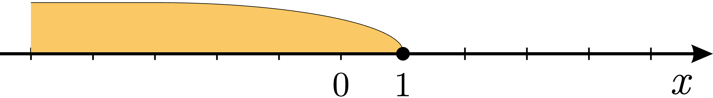

<b>Вiдповiдь.</b> $$x \in (-\infty;1]$$.

Приклад

Розв’язати нерівність: $$5(x-1)>x+3$$.

<b><i>Розв’язок</i></b>.

Розкриваємо дужки та збираємо змінну $$x$$ в лівій частині нерівності:

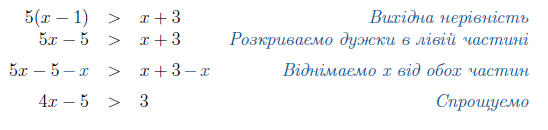

Всі вільні доданки залишаємо в правій частині нерівності:

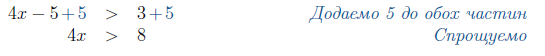

Ділимо обидві частини на коефіцієнт при змінній:

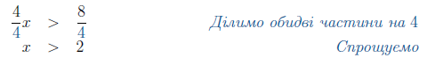

Записуємо відповідь в інтервальному представленні та зображаємо її на числовій прямій:

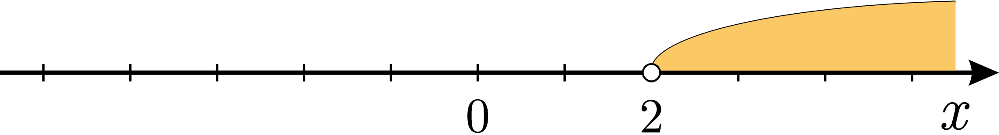

<b>Вiдповiдь.</b> $$x \in (2;+\infty)$$.

Приклад

Розв’язати нерівність: $$\dfrac{(2x-1)^2}{4}-\dfrac{3(x-1)}{4} \geq x^2$$.

<b><i>Розв’язок</i></b>.

Розкриваємо дужки та спрощуємо вирази в лівій частині нерівності:

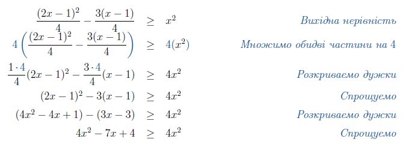

Збираємо всі доданки зі змінною $$x$$ в лівій частині, а вільні доданки – в правій:

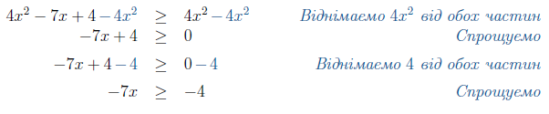

Ділимо на коефіцієнт при змінній:

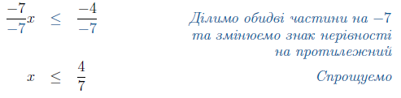

Записуємо відповідь в інтервальному представленні та зображаємо її на числовій прямій:

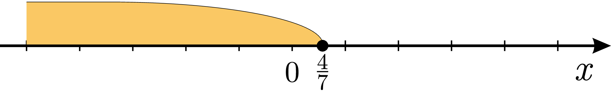

<b>Вiдповiдь.</b> $$x \in \left(-\infty;\dfrac{4}{7}\right]$$.

