# Нерiвностi з модулями

Розглянемо простеньку нерівність:

$$|x|<3.$$

Розкриємо знак модуля за означенням:

Для додатних значень $$x$$ значок модуля прибираємо: $$x<3$$.

Для від’ємних значень $$x$$ при розкритті модуля потрібно помножити підмодульний вираз на $$-1$$:

$$\begin{eqnarray} 
-x &<& 3 \nonumber \\ 
x &>& -3 \nonumber 
\end{eqnarray}$$

В результаті маємо дві умови, що повинні виконуватися одночасно:

$$ 
x<3 \quad i \quad x>-3 \quad \Longleftrightarrow \quad \begin{cases} 
x<3,\\ 
x>-3. 
\end{cases}$$

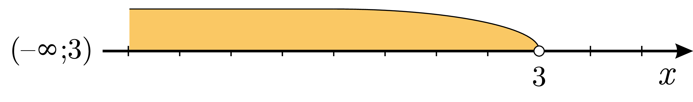

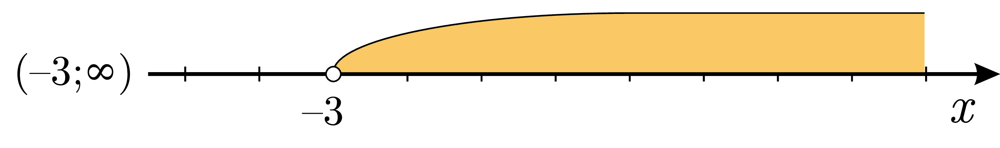

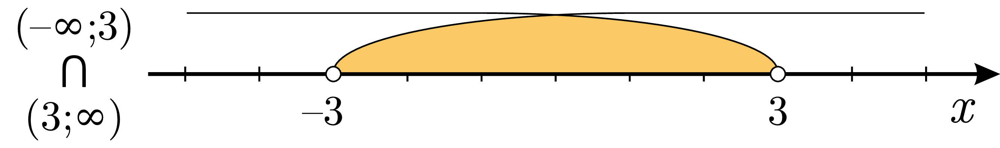

Можна піти простішим шляхом: нерівність $$|x|<3$$ задовольняють значення $$x$$, що лежать на відстані менше $$3$$ від $$0$$ на числовій прямій:

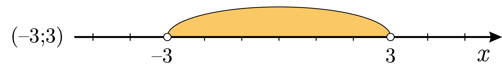

Тобто, можна переписати таку нерівність у вигляді: $$-3<x<3$$. Отримали таку ж відповідь. Одне рівняння з модулем еквівалентне системі двох нерівностей без значків модуля.

Тепер розглянемо іншу нерівність: 

$$|x|\geq2.$$

Розв’язком такого рівняння будуть ті значення $$x$$, що лежать на відстані $$2$$ і більше від $$0$$:

Аналогічно, таке рівняння можна представити у вигляді сукупності двох рівнянь без значків модуля:

$$x\geq2 \quad або \quad x\leq-2 \quad\Longleftrightarrow\quad \left[\begin{gathered} 
x\geq2,\\ 
x\leq-2. 
\end{gathered}\right.$$

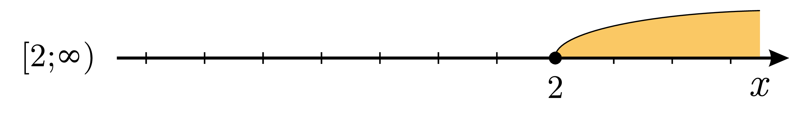

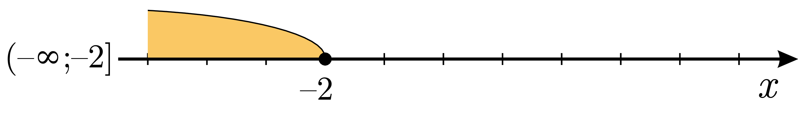

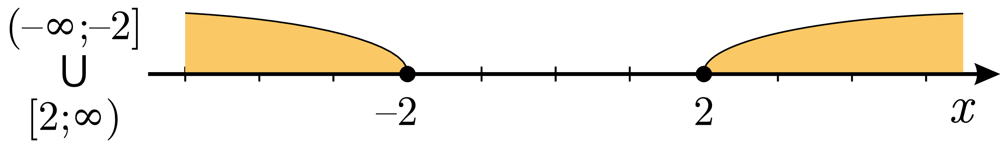

Алгоритм

Всі нерівності зі значками можна звести до таких трьох випадків:

<ol>
<li>$$|f(x)|<g(x) \Longleftrightarrow \begin{cases} 
f(x)<g(x),\\ 
f(x)>-g(x). 
\end{cases}$$</li>
<li>$$|f(x)|>g(x) \Longleftrightarrow \begin{cases} 
f(x)>g(x),\\ 
f(x)<-g(x). 
\end{cases}$$</li>
<li>$$|f(x)|>|g(x)| \Longleftrightarrow f^2(x) > g^2(x).$$</li>
</ol>

Для нестрогих нерівностей все працює точно так само.

Приклад

<b>Межі коливання середньої місячної температури повітря за $$2013$$ рік в м. Києві описуються такою нерівністю: $$|T-8,65|\leq 12,95$$. Знайдіть максимальне та мінімальне значення середньої місячної температури у $$2013$$ році.</b>

<b><i>Розв’язок.</i></b>

Позбавляємося значка модуля:

$$|T-8,65|\leq 12,95\Longleftrightarrow-12,95\leq T-8,65\leq 12,95$$

Розв'язуємо отриману нерівність:

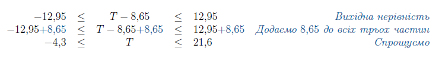

Зображаємо це на числовій прямій:

$$T \in [-4,3;21,6]$$

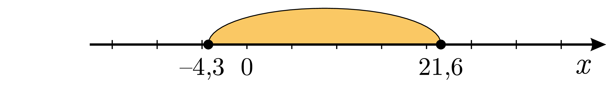

<b>Вiдповiдь.</b>$$T_{min}=-4,3; T_{max}=21,6.$$

Приклад

<b>Розв’язати нерівність: $$|5-2(x+1)|>x-1$$.</b>

<b><i>Розв’язок.</i></b>

Позбавляємося значка модуля:

$$|5-2(x+1)|>x-1\Longleftrightarrow\left[\begin{gathered} 
\hspace{-0.65cm}5-2(x+1)>x-1,\\ 
5-2(x+1)<-(x-1). 
\end{gathered}\right.$$

Розв’язуємо два рівняння сукупності окремо:

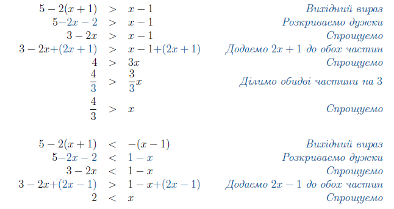

Зобразимо ці розв’язки на числовій прямій та знайдемо їхнє об’єднання:

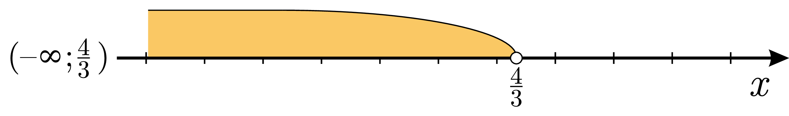

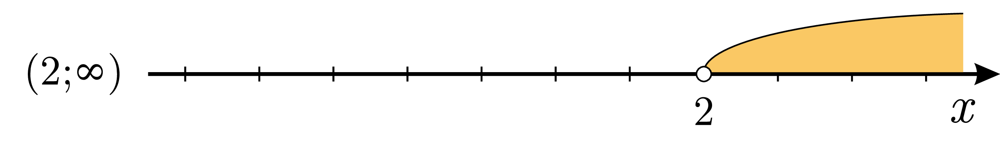

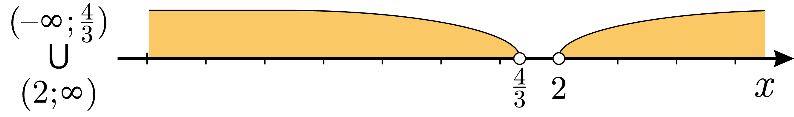

<b>Вiдповiдь.</b>$$x \in \left(-\infty;\dfrac{4}{3}\right)\cup(2;\infty).$$

