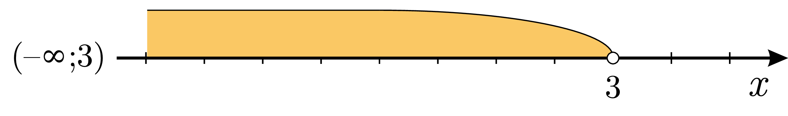

# Нерiвностi з модулями

Розглянемо простеньку нерівність:

$$|x|<3.$$

Розкриємо знак модуля за означенням:

Для додатних значень $$x$$ значок модуля забираємо: $$x<3$$.

Для від’ємних значень $$x$$ при розкритті модуля потрібно помножити підмодульний вираз на $$-1$$:

$$\begin{eqnarray} 
-x &<& 3 \nonumber \\ 
x &>& -3 \nonumber 
\end{eqnarray}$$

В результаті маємо дві умови, що повинні виконуватися одночасно:

$$ 
x<3 \quad i \quad x>-3 \quad \Longleftrightarrow \quad \begin{cases} 
x<3,\\ 
x>-3. 
\end{cases}$$

<iframe align="center" width="560" height="315" src="https://www.youtube.com/embed/DdlJOHgJIls" frameborder="0" allowfullscreen></iframe>

 

Можна піти простішим шляхом: нерівність $$|x|<3$$ задовольняють значення $$x$$, що лежать на відстані менше $$3$$ від $$0$$ на числовій прямій:

Тобто можна переписати таку нерівність у вигляді: $$-3<x<3$$. Отримали таку саму відповідь. Одне рівняння з модулем еквівалентне системі двох нерівностей без значків модуля.

Тепер розглянемо іншу нерівність: 

$$|x|\geq2.$$

Розв’язком такого рівняння будуть ті значення $$x$$, що лежать на відстані $$2$$ і більше від $$0$$:

Аналогічно, таке рівняння можна представити у вигляді сукупності двох рівнянь без значків модуля:

$$x\geq2 \quad або \quad x\leq-2 \quad\Longleftrightarrow\quad \left[\begin{gathered} 
x\geq2,\\ 
x\leq-2. 
\end{gathered}\right.$$

Алгоритм

Всі нерівності з модулями можна звести до таких трьох випадків:

<ol>
<li>$$|f(x)|<g(x) \Longleftrightarrow \begin{cases} 
f(x)<g(x),\\ 
f(x)>-g(x). 
\end{cases}$$</li>
<li>$$|f(x)|>g(x) \Longleftrightarrow \begin{cases} 
f(x)>g(x),\\ 
f(x)<-g(x). 
\end{cases}$$</li>
<li>$$|f(x)|>|g(x)| \Longleftrightarrow f^2(x) > g^2(x).$$</li>
</ol>

Для нестрогих нерівностей все працює точно так само.

Приклад

<b>Межі коливання середньої місячної температури повітря за $$2013$$ рік в м. Києві описуються такою нерівністю: $$|T-8,65|\leq 12,95$$. Знайдіть максимальне та мінімальне значення середньої місячної температури у $$2013$$ році.</b>

<b><i>Розв’язок.</i></b>

Позбавляємося значка модуля:

$$|T-8,65|\leq 12,95\Longleftrightarrow-12,95\leq T-8,65\leq 12,95$$

Розв'язуємо отриману нерівність:

<table style="border: none;" class="none">
<tr>
<td>$$
    \begin{align}
        -12,95 && \le && T - 8,65 && \le && 12,95 \\
        \\
        -12,95 \color{#1570bd}+ \color{#1570bd}8\color{#1570bd},\color{#1570bd}6\color{#1570bd}5 && \le && T -8,65 \color{#1570bd}+ \color{#1570bd}8\color{#1570bd},\color{#1570bd}6\color{#1570bd}5 && \le && 12,95 \color{#1570bd}+ \color{#1570bd}8\color{#1570bd},\color{#1570bd}6\color{#1570bd}5 \\
        \\
        -4,3 && \le && T && \le && 21,6
    \end{align}$$</td>
<td><i>Вихідна нерівність Додаємо $$8,65$$ до всіх трьох частин Спрощуємо</i></td>
</tr>
</table>

Зображаємо це на числовій прямій:

$$T \in [-4,3;21,6]$$

<b>Вiдповiдь.</b>$$T_{min}=-4,3; T_{max}=21,6.$$

Приклад

<b>Розв’язати нерівність: $$|5-2(x+1)|>x-1$$.</b>

<b><i>Розв’язок.</i></b>

Позбавляємося значка модуля:

$$|5-2(x+1)|>x-1\Longleftrightarrow\left[\begin{gathered} 
\hspace{-0.65cm}5-2(x+1)>x-1,\\ 
5-2(x+1)<-(x-1). 
\end{gathered}\right.$$

Розв’язуємо два рівняння сукупності окремо:

<table style="border: none;" class="none">
<tr>
<td>$$
    \begin{align}
        5 - 2(x+1) & \gt x-1 \\
        5 \color{#1570bd}- \color{#1570bd}2\color{#1570bd}x \color{#1570bd}- \color{#1570bd}2 & \gt x-1 \\
        3 - 2x & \gt x-1 \\
        3 - 2x \color{#1570bd}+ \color{#1570bd}(\color{#1570bd}2\color{#1570bd}x\color{#1570bd}+\color{#1570bd}1\color{#1570bd}) & \gt x - 1 \color{#1570bd}+ \color{#1570bd}(\color{#1570bd}2\color{#1570bd}x \color{#1570bd}+ \color{#1570bd}1\color{#1570bd}) \\
        4 & \gt 3x \\
        \dfrac{4}{\color{#1570bd}3} & \gt \dfrac{3}{\color{#1570bd}3}x \\
        \dfrac{4}{3} & \gt x
    \end{align}$$</td>
<td><i>Вихідний вираз Розкриваємо дужки Спрощуємо Додаємо $$2x+1$$ до обох частин Спрощуємо Ділимо обидві частини на $$3$$ Спрощуємо</i></td>
</tr>
</table>

<table style="border: none;" class="none">
<tr>
<td>$$
    \begin{align}
        5 - 2(x+1) & \lt -(x-1) \\
        5 \color{#1570bd}- \color{#1570bd}2\color{#1570bd}x \color{#1570bd}- \color{#1570bd}2 & \lt \color{#1570bd}1 \color{#1570bd}- \color{#1570bd}x \\
        3 - 2x & \lt 1 - x \\
        3 - 2x \color{#1570bd}+ \color{#1570bd}(\color{#1570bd}2\color{#1570bd}x\color{#1570bd}-\color{#1570bd}1\color{#1570bd}) & \lt 1 - x \color{#1570bd}+ \color{#1570bd}(\color{#1570bd}2\color{#1570bd}x\color{#1570bd}-\color{#1570bd}1\color{#1570bd}) \\
        2 & \lt x
    \end{align}$$</td>
<td><i>Вихідний вираз Розкриваємо дужки Спрощуємо Додаємо $$2x-1$$ до обох частин Спрощуємо</i></td>
</tr>
</table>

Зобразимо ці розв’язки на числовій прямій та знайдемо їхнє об’єднання:

<b>Вiдповiдь.</b>$$x \in \left(-\infty;\dfrac{4}{3}\right)\cup(2;\infty).$$

<quiz correctLabel="correct" incorrectLabel="incorrect" checkLabel="check">
 <question text="">
        
Розв'яжіть нерівність: $$|x−5|>4$$

        <answer correct>$$(-\infty;1)\cup(9;\infty)$$</answer>
        <answer>$$(-\infty;1)\cap(9;\infty)$$</answer>
        <answer>$$(1;9)$$</answer>
        <answer>$$(-\infty;\infty)$$</answer>
        <explanation>
        
Розкриємо модуль з додатним знаком:

        
$$x-5>4$$

        
$$x>9$$

        
Розкриємо модуль з від'ємним знаком:

        
$$-x+5>4$$

        
$$x<1$$

        
Об'єднання інтервалів і буде розв'яззком: $$(-\infty;1)\cup(9;\infty)$$

        </explanation>
</question>
</quiz>