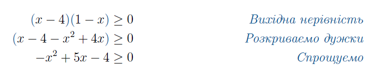
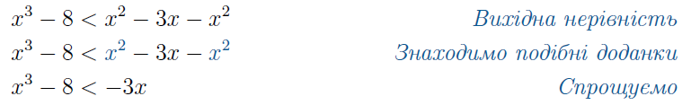
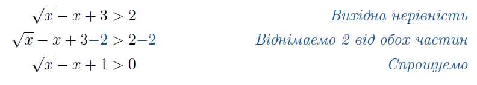
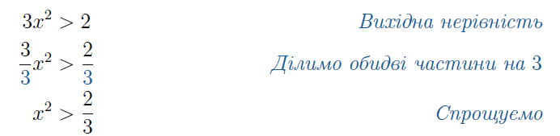
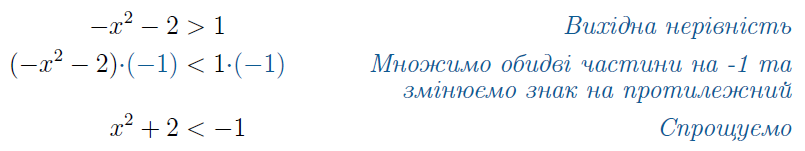

#Основні властивості

Ці операції можна використовувати для виконання рівносильних переходів, що не змінюють множини розв’язків нерівності:

<ol>
<li>
Співвідношення «менше» і «більше» протилежні одне одному.

<i>Наприклад:</i> якщо $$8 > x$$, то $$x < 8$$.
</li>
<li>
Відношення транзитивності:

<ul>
<li>
якщо $$x<a$$ і $$a<b$$, то $$x<b$$;
</li>
<li>
якщо $$x>a$$ і $$a>b$$, то $$x>b$$.
</li>
</ul>

<i>Наприклад:</i> якщо $$x<3$$ і $$3<y$$, то $$x<y$$.
</li>
<li>
Розкрити дужки в будь-якій частині нерівності.

<i>Наприклад:</i>
</li>

<li>
Звести подібні доданки в будь-якій частині нерівності.
</li>

<i>Наприклад:</i>
</li>

<li>
До обох частин додати або ж відняти будь-який вираз.
</li>

<i>Наприклад:</i>
</li>

<li>
Обидві частини помножити або поділити на одне й те саме число, відмінне від нуля:
</li>
<ul>
<li>
Якщо вираз додатний – знак нерівності залишається без змін.
</li>

<i>Наприклад:</i>
</li>

<li>
Якщо вираз від’ємний – знак нерівності змінюється на протилежний.
</li>

<i>Наприклад:</i>
</li>

</ul>
</ol>

