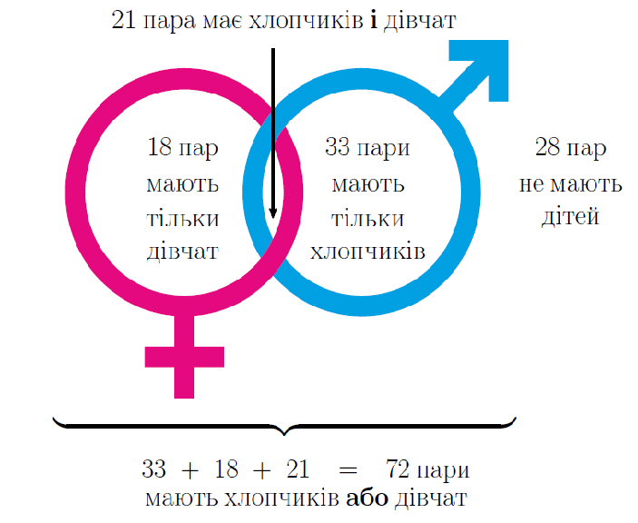

# Система та сукупність нерівностей

Розглянемо таку життєву ситуацію. Михайло вчиться на соціолога. Нещодавно він провів опитування сімейних пар на вулицях Київа. Він задав два питання: «Чи маєте Ви хлопчика?» та «Чи маєте Ви дівчинку?». Загалом було $$100$$ сімейних пар. Результати можна представити у вигляді такої діаграми:

З діаграми випливає, що $$72$$ пари мають хлопчиків <b>або</b> дівчаток. Крім того, $$21$$ пара мають хлопчиків <b>і</b> дівчаток одночасно. Слова «<b>або</b>» та «<b>і</b>» тут вжиті невипадково, вони представляють логічні операції об’єднання та перетину множин «пара має хлопчиків» та «пара має дівчинок».

Аналогічно, при розв’язанні нерівностей часто потрібно користуватись <b>операціями об’єднання та перетину</b> інтервалів.

Алгоритм <b>Об’єднання та перетин інтервалів</b>

<ol>
<li>Зобразити інтервали на числовій прямій.</li>
<li>Для знаходження <b>об’єднання</b> потрібно взяти ті частини прямої, що належать <b>хоча б одному інтервалу</b>. Об’єднання, як і у теорії множин позначається значком $$\cup$$.</li>
<li>Для знаходження <b>перетину</b> потрібно взяти ті частини прямої, що належать <b>обом інтервалам одночасно</b>. Перетин, як і у теорії множин позначається значком $$\cap$$.</li>
</ol>

Приклад

<b>Знайти об’єднання та перетин інтервалів $$[1;7]$$ та $$(5;9)$$.</b>

<b><i>Розв’язок.</i></b>

Зобразимо інтервали на числовій прямій:

Для знаходження об’єднання потрібно взяти ті частини прямої, які належать першому <b>або</b> другому (хоча б одному) інтервалам.

Отже $$[1;7] \cup (5;9) = [1;9)$$.

Для знаходження перетину потрібно взяти ті частини прямої, які належать першому <b>i</b> другому (обом одночасно) інтервалам.

Отже $$[1;7] \cap (5;9) = (5;7]$$.

<b>Вiдповiдь.</b>$$[1;9), (5;7].$$

Приклад

<b>Знайти значення змінної $$x$$, якщо вона повинна задовольняти умови: $$\begin{eqnarray}\dfrac{x}{2} - 1 > 0 & або & -\dfrac{1}{4}(x+1) > 0 \nonumber \end{eqnarray}$$</b>

<b><i>Розв’язок.</i></b>

Розв’яжемо окремо два рівняння з умови, а потім знайдемо об’єднання (<b>або</b>) отриманих розв’язків.

$$\begin{eqnarray} 
			\dfrac{x}{2} - 1 > 0 & або & -\dfrac{1}{4}(x+1) > 0 \nonumber \\
			\dfrac{x}{2} > 1 & & x + 1 < 0 \nonumber \\
			x > 2 & & x < -1 \nonumber
			\end{eqnarray}$$

Отже, маємо такі умови для змінної:  $$x>2$$ або $$x<-1$$.

Зобразимо ці розв’язки на числовій прямій та знайдемо їхнє об’єднання:

Отже, значення змінної $$x$$ повинно лежати у межах $$(-\infty,-1) \cup (2,\infty)$$ щоб задовольнити умові.

<b>Вiдповiдь.</b>$$(-\infty,-1) \cup (2,\infty).$$

Приклад

<b>Знайти значення змінної $$x$$, якщо вона повинна задовольняти умови: $$\begin{eqnarray} -3(x-5)\leq 6 & i & x-2<5 \nonumber \end{eqnarray}$$

$$\begin{eqnarray} -3(x-5)\leq 6 & i & x-2<5 \nonumber \\
-3x+15 \leq 6 && x<7 \nonumber \\
-3x \leq -9 \nonumber \\
x \geq 3 \nonumber
\end{eqnarray}$$

<b><i>Розв’язок.</i></b>

Розв’яжемо окремо два рівняння з умови, а потім знайдемо перетин (<b>i</b>) отриманих розв’язків.

$$\begin{eqnarray} -3(x-5)\leq 6 & i & x-2<5 \nonumber \\
			-3x+15 \leq 6 && x<7 \nonumber \\
			-3x \leq -9  \nonumber \\
			x \geq 3 \nonumber
			\end{eqnarray}$$

Отже, маємо такі умови для змінної:  $$x\geq3$$ або $$x<7$$.

Іншим чином це запишеться як: $$3\leq x<7$$.

Зобразимо ці розв’язки на числовій прямій та знайдемо їхнє об’єднання:

Отже, значення змінної $$x$$ повинно лежати у межах $$[3,7)$$ щоб задовольнити умові.

<b>Вiдповiдь.</b>$$[3,7).$$

Скорочений запис перетину нерівностей

Якщо $$a<b$$, і має місце перетин нерівностей:

$$a<x$$$$\quad$$ і $$\quad$$ $$x<b$$

то це можна записати у скороченій формі, як

$$a<x<b.$$

Всі операції в такому записі проводяться одночасно над всіма трьома сторонами нерівності. Під час розв’язання метою є <b>залишити змінну $$x$$ «на самоті» в центральній частині</b> нерівності.

Насправді, ми вже навчились розв’язувати найпростіші системи та сукупності нерівностей.

Система нерівностей

Якщо між двома нерівностями стоїть слово «<b>і</b>» - тобто мається на увазі <b>перетин розв’язків нерівностей</b> – це значить, що змінна повинна <b>задовольнити обидві нерівності</b> одночасно. Перед нами ніщо інше, як <b>система нерівностей</b>. Такі нерівності записуються одна під іншою з <b>великою фігурною скобкою зліва</b>. Умова попереднього прикладу тоді виглядатиме як:

$$-3(x-5)\leq 6 \quad i \quad x-2<5 \quad \Longleftrightarrow \quad \begin{cases} 
-3(x-5)\leq 6,\\ 
x-2<5. 
\end{cases}$$

спростивши:

$$ 
x \geq 3 \quad i \quad x<7 \quad\Longleftrightarrow\quad3\leq x<7\quad\Longleftrightarrow\quad \begin{cases} 
x \geq 3,\\ 
x<7. 
\end{cases}  
$$

Скорочений запис перетину нерівностей

Якщо $$a<b$$, і має місце перетин нерівностей:

$$a<x$$$$\quad$$ і $$\quad$$ $$x<b$$

то це можна записати у скороченій формі, як

$$a<x<b.$$

