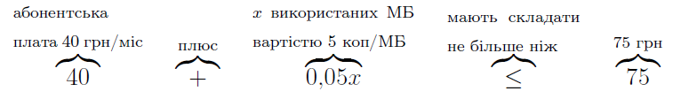
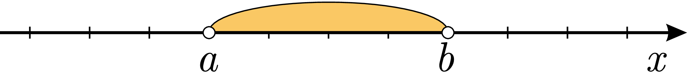
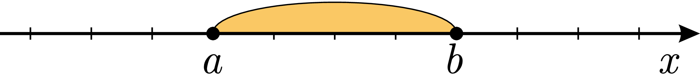
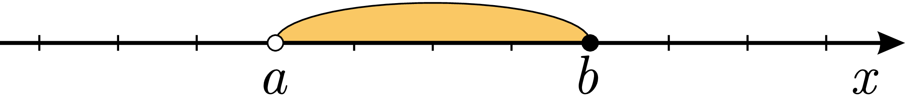
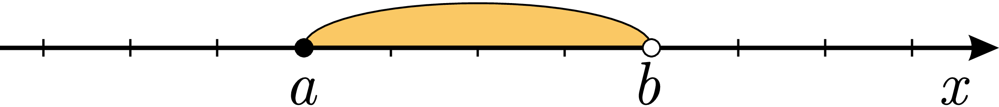
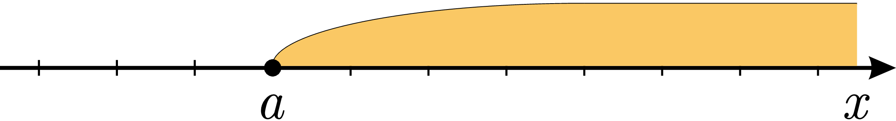
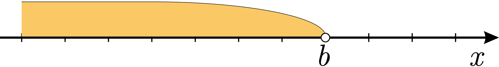

#Загальні відомості

Розглянемо таку життєву ситуацію.

Сашко планує бюджет на найближчий місяць, зокрема витрати на мобільний зв’язок. Він користується тарифним планом «Шалений день» оператора «Кайф :)». За цим планом абонентська плата складає $$40$$ грн/міс, а вартість $$1$$ Мб трафіку мобільного інтернету – $$5$$ копійок. У бюджеті Сашко виділяє $$75$$ грн на користування мобільним зв’язком. Якщо представити кількість використаних Мб інтернету на місяць як $$x$$, то задані умови можна сформулювати таким чином:

Визначення

<b>Нерівність</b> — це співвідношення двох математичних об’єктів, що вказує їхню відносну величину та порядок (якщо такий можна встановити).

<b>Строгими нерівностями</b> називають такі співвідношення:

<ul>
<li>$$a < b$$ значить, що $$a$$ менше, ніж $$b$$;</li>
<li>$$a > b$$ значить, що $$a$$ більше, ніж $$b$$.</li>
</ul>

Також виділяють <b>нестрогі нерівності</b>:

<ul>
<li>$$a \leq b$$ значить, що $$a$$ <b>менше або дорівнює</b> $$b$$;</li>
<li>$$a \geq b$$ значить, що $$a$$ <b>більше або дорівнює</b> $$b$$.</li>
</ul>

Поняття <b>кореня</b> для нерівностей не вводять.

Розв’язати нерівність означає знайти множину значень змінної, при підстановці яких нерівність є правильною.

Множину розв'язків зазвичай записують в <b>інтервальному представленні</b>.

Припустимо, що числа $$a$$ і $$b$$ є дійсними, причому $$a < b$$.

Інтервал складається з множини чисел, що міститься між двома числами $$a$$ і $$b$$ – кінцями інтервалу — або нижньою та верхньою границями відповідно.

Розглянемо основні типи інтервалів та методи їх зображення на числовій прямій.

<ul>
<li><b>Відкритий</b> інтервал $$(a,b)$$ не включає кінцеві точки і відповідає нерівності $$a < x < b$$.</li>

<li>Якщо кінцеві точки включаються до інтервалу, то він називається <b>закритим</b>, позначається $$[a,b]$$ і відповідає нерівності $$a \leq x \leq b$$.</li>

<li>Інколи одна границя включається до інтервалу, а інша – ні. Такі випадки називають <b>напівінтервалами</b>, позначають $$(a,b]$$ та $$[a,b)$$ і їм відповідають нерівності $$a < x \leq b$$ та $$a \leq x < b$$.</li>

<li>Якщо інтервал необмежений з однієї сторони, його називають <b>нескінченним</b>. Наприклад, інтервал $$[a,\infty)$$ відповідає нерівності $$x\geq a$$, а інтервал $$(-\infty,b)$$ – нерівності $$x<b$$.</li>

</ul>

<iframe align="center" width="560" height="315" src="https://www.youtube.com/embed/Haxwi95BmWQ" frameborder="0" allowfullscreen></iframe>

 

Дужки та крапочки

Круглі дужки вказують на те, що кінцеві точки не включені до інтервалу. Квадратні дужки вказують на те, що кінцеві точки включені до інтервалу. Круглі дужки завжди використовуються зі значком $$\infty$$ або $$-\infty$$.

Аналогічно при зображенні на числовій прямій: якщо кінцева точка не включена до інтервалу, то її зображають порожнім кружечком $$\circ$$, якщо включена – замальованим $$\bullet$$.

Визначення

<b>Алгебраїчна нерівність</b> — це співвідношення вигляду $$f(x) > 0$$ або $$f(x)<0$$ або $$f(x) \geq 0$$ або $$f(x) \leq 0$$, де $$f(x)$$ – деяка дійсна функція від змінної $$x$$.

<i>Наприклад:</i>$$x<2; 4x^2-8x\leq x^3; \sqrt{x}<6x.$$

В загальному випадку розв'язання нерівностей дуже схоже на розв'язання рівнянь: використовують рівносильні переходи до простіших у розв'язанні нерівностей. Відмінності полягають у тому, що часто множина розв'язків є необмеженою. Наприклад, $$x \in (2;+\infty)$$. В такому випадку повністю перевірити всі значення неможливо, і важливо при цьому користуватись <b>лише рівносильними переходами</b>, пам'ятаючи, що <b>ОДЗ повинна залишатись незмінною</b>.

<quiz correctLabel="correct" incorrectLabel="incorrect" checkLabel="check">
 <question multiple>
        
Вкажіть всі відкриті інтервали:

        <answer correct>$$(1;3)$$</answer>
        <answer>$$[1;2)$$</answer>
        <answer correct>$$(-21;0)$$</answer>
        <answer>$$[17;54]$$</answer>
        <answer>$$(-\infty;0)$$</answer>
        <answer>$$(-12;2]$$</answer>
        <answer correct>$$(\dfrac{1}{2};10)$$</answer>
        <answer correct>$$(0;\dfrac{7}{6})$$</answer>
</question>
<question multiple>
        
Вкажіть всі закриті інтервали:

        <answer>$$(1;3)$$</answer>
        <answer>$$[1;2)$$</answer>
        <answer>$$(-21;0)$$</answer>
        <answer correct>$$[17;54]$$</answer>
        <answer>$$(-\infty;0)$$</answer>
        <answer>$$(-12;2]$$</answer>
        <answer>$$(\dfrac{1}{2};10)$$</answer>
        <answer>$$(0;\dfrac{7}{6})$$</answer>
</question>
<question multiple>
        
Вкажіть всі напівінтервали:

        <answer>$$(1;3)$$</answer>
        <answer correct>$$[1;2)$$</answer>
        <answer>$$(-21;0)$$</answer>
        <answer>$$[17;54]$$</answer>
        <answer>$$(-\infty;0)$$</answer>
        <answer correct>$$(-12;2]$$</answer>
        <answer>$$(\dfrac{1}{2};10)$$</answer>
        <answer>$$(0;\dfrac{7}{6})$$</answer>
</question>
<question multiple>
        
Вкажіть всі нескінчені інтервали:

        <answer>$$(1;3)$$</answer>
        <answer>$$[1;2)$$</answer>
        <answer>$$(-21;0)$$</answer>
        <answer>$$[17;54]$$</answer>
        <answer correct>$$(-\infty;0)$$</answer>
        <answer>$$(-12;2]$$</answer>
        <answer>$$(\dfrac{1}{2};10)$$</answer>
        <answer>$$(0;\dfrac{7}{6})$$</answer>
</question>
</quiz>